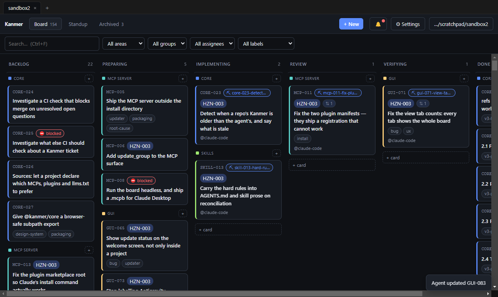

# Proof — GUI-071

Verified on **merged `main`**, commit `5cab894` ("Fix the view tab counts:
every tab shows the whole board (GUI-071) (#53)"), squash-merged 2026-08-16
23:31:44Z. PR: https://github.com/collisionengineers/kanmer/pull/53

Landed diff: 4 files, +323/−30 —
`apps/gui/src/renderer/src/lib/views.ts` (new),
`apps/gui/src/renderer/src/lib/views.test.ts` (new),
`apps/gui/src/renderer/src/App.tsx`,
`docs/functional/frd/FRD-019-gui-shell.md`.

**Six other PRs landed between this branch's base (`0c4ffda`) and its merge** —
#46, #47, #48, #49, #50, #51. GitHub merged cleanly; none touches `App.tsx` or
the renderer's `lib/`. One consequence for anyone reading the brief: DOC-007
(#49) rewrote the in-app manual, so `check:manual` now reports **19 chapters**
where it reported 11 at this branch's base. Not a regression from this change
and not caused by it; the pass condition is "up to date", which holds.

## Evidence

### Rail, on merged main

```
$ npm run typecheck
> @kanmer/core@0.1.0 typecheck          clean
> @kanmer/mcp-server@0.1.0 typecheck    clean
> @kanmer/ui@0.2.0 typecheck            clean
> @kanmer/gui@0.3.2 typecheck           clean   (tsconfig.node.json + tsconfig.web.json)

$ npm run build:ui
@kanmer/core   ESM build success · DTS build success
@kanmer/ui     ESM build success · DTS build success

$ npm run check:manual
manual: up to date (19 chapters)

$ npm test
@kanmer/core    Test Files  9 passed (9)     Tests  193 passed (193)
@kanmer/gui     Test Files 22 passed (22)    Tests  253 passed (253)
test:scripts    tests 41 · suites 6 · pass 41 · fail 0

$ cd apps/gui && npx vitest run src/renderer/src/lib/views.test.ts
Test Files  1 passed (1)     Tests  13 passed (13)
```

**The whole suite is green on merged main, `kanmerGit.test.ts` included** —
22/22 files, 253/253 tests, no reruns and no raised timeout. That file flaked
once during pre-merge work (1 of 7: *`renameBoardBranch > renames locally even
with no remote to push to` — Test timed out in 5000ms*) and was 7/7 green when
rerun alone with `--testTimeout=30000` in 54.7s, individual cases taking
4.2–13.1s against a 5s default. It did not fire here. Established as
pre-existing and load-dependent, in a file (`src/main/`) this diff does not
touch; it has its own ticket and was not chased.

### Runtime, on a build of merged main

App built with `electron-vite build`, launched against a copy of the live board
with `--remote-debugging-port` and a fresh `--user-data-dir`, then driven over
CDP. Every line below is an observation read out of the DOM, not a claim:

```
tabs                 ["Board 155", "Standup", "Archived 2"]
column counts        Backlog 22 · Preparing 5 · Implementing 2 · Review 1 · Verifying 1 · Done 124
                     22+5+2+1+1+124 = 155
cards rendered       155
```

The Board badge equals the sum of the columns and equals the number of cards on
screen. **The badge is the rows the view shows.**

```
search "GUI-071" →
tabs                 ["Board 155", "Standup", "Archived 2"]      badges hold still
column counts        Verifying 1 · Done 1, all others empty      columns narrow
cards rendered       2

clear search →
tabs                 ["Board 155", "Standup", "Archived 2"]
```

155 in the header while the columns beneath it sum to 2 — FRD-019 **R5a and
R5b demonstrated together**, and both numbers correct.

```
Ctrl+3 → "Archived 2"   Ctrl+1 → "Board 155"   Ctrl+2 → "Standup"
Ctrl+3 → "Archived 2"   Ctrl+1 → "Board 155"
```

Pressed out of order and repeated, so this is a mapping and not a lucky
sequence: moving the view list into `lib/views.ts` left the shortcuts intact.

```
archive one ticket by writing archived: true to its file on disk →
before   ["Board 155", "Standup", "Archived 2"]
after    ["Board 154", "Standup", "Archived 3"]
```

One ticket moved from Board to Archived, live, through the real file watcher —
no reload, no re-open. (The sandbox file was restored afterwards.)



## The ticket's verification criteria

- [x] **"Board tab count matches the documented meaning, asserted in a test so
      the next filter change cannot silently break it."** The documented
      meaning is now written down — FRD-019 **R5a**: every non-archived ticket,
      Done included, excluding `plan`/`research` items. Observed at 155, equal
      to both the column sum and the rendered card count. Asserted in
      `lib/views.test.ts`, and asserted **as a property over `VIEW_IDS`** rather
      than per view, so a view added later is covered without editing the test.
      The next filter change cannot silently break it because `viewItemsFor`
      takes no filter argument at all.
- [x] **"Archived count unchanged."** Reads 2, the same rule as before
      (`items.filter(i => i.archived)`), and still counts non-ticket items
      because the Archived view renders them. The test asserts that asymmetry
      with Board in **both** directions so it cannot be normalised away.
- [x] **"Counts update live when a ticket moves between stages."** Stronger
      than asked, and worth being precise about: under the documented meaning a
      *stage* move must **not** change the Board badge, since Board counts every
      stage — asserted directly in `views.test.ts` ("is unmoved by a ticket
      changing stage"). The live recomputation itself was demonstrated with the
      transition that *does* change the numbers: archiving a ticket on disk took
      Board 155→154 and Archived 2→3 through the watcher, with no reload.
- [x] *(struck by GUI-070)* "Backlog tab count equals the number of rows the
      Backlog view shows" — there is no Backlog view and no Backlog tab. Nothing
      to verify.

## What actually shipped, stated plainly

**No printed number changed.** Post-GUI-070 the old expression's two branches
coincide exactly with the two surviving counted views' predicates, so the badges
were already showing the right numbers. They were right by **coincidence**: the
expression branched only on `archived` and was never a function of the view, and
it agreed with the views only because Backlog — the one view whose predicate
differed, and whose badge printed the whole board at ~5× its rows — had just
been deleted.

What shipped is the missing branch. The view rule now lives once, in
`lib/views.ts`, with each view's label, item set and badge keyed together so a
new view does not compile until it says what it contains. Three surviving inline
copies (`allViewItems`, the badge JSX, the `FilterBar` items prop) are gone; the
fourth went with `BacklogTable` in GUI-070. The meaning is written into FRD-019
R5a/R5b/R5c, where R5's silence on badges was what let "111" survive in the
first place. And the equality between a badge and its view is now a test that
holds for views nobody has written yet.
