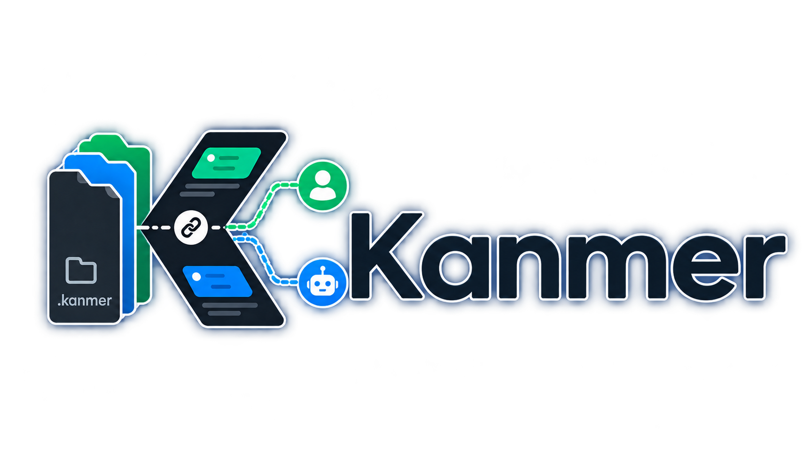

# Kanmer



A Kanban / ticket manager where **AI agents and a human share one dataset**.

Agents (codex, Claude Code, Claude Desktop — any MCP client) create and update work through a local **MCP server**; you review, re-arrange and edit the same work through a **Windows desktop GUI**. Both sides operate on one source of truth: a `.kanmer/` folder of Markdown-with-frontmatter files inside each project. Neither talks to the other — they sync through the files, and the GUI live-reloads when anything changes on disk.

```
codex / Claude / any MCP client ──stdio──► kanmer-mcp ─┐
                                                        ├─► .kanmer/  (Markdown + frontmatter = source of truth)
              You ──► Kanmer GUI (Electron) ────────────┘        ▲
                          └── watches .kanmer/ ──────────────────┘  (live reload on external change)
```

## Layout

```
packages/core         Shared store: types, frontmatter, ids, links, docs, activity, migration, watcher
packages/mcp-server   Local stdio MCP server (20 tools) — the agent surface
apps/gui              Electron + React kanban desktop app — the human surface
examples/             Example codex config
```

## The `.kanmer/` folder

Created in a project the first time something is actually written to the board
(the GUI's "Open project", or an agent's first write — a read-only MCP session
never creates it):

```
.kanmer/
  version.json          { "format": 3 } — storage format marker
  data/board.yml        Areas (+ id prefixes), profiles, group kinds and proof types
  data/counters.json    Per-prefix id counters
  data/activity.jsonl   Append-only change log (derived — safe to delete)
  areas/
    api/                One folder per area (folder name = area id)
      API-001/          One folder per ticket (folder name = ticket id)
        API-001.md      THE TICKET — governs everything in this folder
        research/       What was learned for it
          findings.md
        files/          The files/modules the change touches
          surface.md
        plan/           The chosen approach
          plan.md
        checklist/      The plan as tickable steps
          checklist.md
        open-questions/ Decisions that still need an answer
        post-implementation-report/  What changed, for review
        proof/          Evidence it works after merge
    pr-review/          Default area on new boards (prefix PR)
    _none/              Tickets with no area (prefix TICK)
```

**The ticket is the governing unit.** Its id comes from the area it was born in
(`API-001`) and never changes — moving a ticket to another area moves its
folder, not its id, so `[[API-001]]` references stay valid forever. A ticket can
carry seven document types: research, files, plan, checklist, open questions,
post-implementation report and proof. Each type is a folder, so a ticket can
hold several documents of the same type. A ticket's profile decides which ones
it owes at each stage; proof is gathered after merge, before it reaches Done.

Each item is Markdown with frontmatter; the body may reference other items with `[[ID]]` wiki-links, `links:` holds structured relations, and `blocks:` holds dependency edges (blocked-by is derived, never stored).

```markdown
---
id: API-001
type: ticket
title: Wire up create_item tool
status: implementing
area: api
assignee: claude
taken_at: 2026-08-13T09:12:00.000Z
branch: feat/create-item
labels: [mcp]
links: [API-002]
---
Implements the tool. See [[API-002]].
```

**One workflow dimension.** A ticket has a single `status` — the stage it's at.
The default stages are the board's columns, left to right:

```
Backlog → Preparing → Implementing → Review → Verifying → Done
```

`area` is an orthogonal, colour-coded grouping (UI, API, Infra…) that clusters
cards *within* each column and gives newly created tickets their id prefix.
Stages are fixed so they mean the same thing on every board. Preparing is the
shared stage for research, file mapping and planning; a ticket's profile decides
what evidence it needs to move on.

**Upgrading an older board:** the GUI keeps an earlier-format board read-only
until you choose **Migrate to format 3**. The migration maps old stages onto the
six fixed stages, sorts documents into their type folders, and assigns each
ticket a profile. It preserves ticket ids.

## Install — the easy way (Windows installer)

Build a real double-click installer:

```bash
npm run setup      # install deps + build everything
npm run dist       # produce apps/gui/release/Kanmer Setup <version>.exe
```

Run `Kanmer Setup ….exe` → Start-Menu shortcut, normal desktop app. The MCP server ships **inside** the app (`resources/mcp/kanmer-mcp.cjs`) and runs via Electron-as-Node, so **no separate Node install is needed** on the target machine.

**Connect an agent with one click:** open a project in Kanmer → **⚙ Settings → Connect an AI agent → Connect codex / Connect Claude Code**. It runs the agent's `mcp add` command for you (with a copy-paste fallback shown if the CLI isn't on `PATH`). Restart the agent and it can drive that project's board.

> **Antivirus note:** electron-builder downloads a 7-Zip helper that Windows Defender sometimes false-positive quarantines. If `npm run dist` fails with `ENOENT … 7za.exe`, restore the file from Defender's quarantine (or add a folder exclusion for the repo) and re-run. electron-builder ≥26 (pinned here) fetches it fresh, which usually avoids this.

## Updates

Kanmer keeps itself up to date from GitHub Releases.

- It checks about **30 seconds after launch** and every **6 hours**, downloads in the background, and shows a banner when an update is ready.
- **Restart now** installs immediately. **Later** costs nothing — the update installs the next time you quit Kanmer.
- **An update closes any agent MCP session running from the installed app.** The installer stops every process in the install folder, and the MCP server *is* the app's own binary. Kanmer tells you how many sessions are open before it restarts, and asks again if you quit with an update staged. Your board is safe — `.kanmer/` writes are atomic — it is the agent's connection that drops, and the agent reconnects against the new server.
- The installer is **unsigned**, so SmartScreen warns on a *manual* download — but not on an auto-update, which is spawned by an already-trusted process with no Mark-of-the-Web. The friction is paid once, on first install.
- **To go back one version:** re-run `%LOCALAPPDATA%\@kanmergui-updater\installer.exe` — the previously installed installer keeps a copy of itself there. There is no automatic rollback; the normal remedy for a bad release is a higher version.

## Develop / run from source

```bash
npm install
npm run build            # core + mcp-server
npm test                 # core + GUI test suites
npm run app              # build + launch the GUI
# or hot-reload dev:
npm run dev:gui
```

> **Windows, from source and installed:** Electron derives its app name from the
> workspace package (`@kanmer/gui`). From source, that can make the
> single-instance lock fail and the app quit before showing a window; launch it
> with a fresh user-data folder instead:
> `cd apps/gui && npx electron . --user-data-dir=<a fresh dir>`. The packaged
> app uses the same name for its user-data and updater-cache paths
> (`%APPDATA%\@kanmer\gui\` and `%LOCALAPPDATA%\@kanmergui-updater`),
> although the source-only single-instance-lock failure does not apply to the
> packaged executable.

Click **Open project folder…** and pick any project (recently opened folders are listed, and the last one re-opens on launch). Kanmer creates/loads its `.kanmer/` folder there.

### Shared board worktree

For Git repositories, the GUI keeps the board in a canonical worktree at
`<source-root>/.worktrees/kanmer` on the global **Kanmer branch** (default
`kanmer-board`). The project tab, governing documents, agent skills, and agent
working directory stay bound to the source root; only the MCP server is rooted
at the board worktree. The Git settings tab can enable a whole-minute automatic
sync or run one manual sync. On a conflict or authentication failure, sync is
paused for that project and local board commits are retained; use **Retry**
after resolving access or content conflicts. A second machine only needs the
source checkout: opening it in Kanmer fetches and attaches the configured board
branch automatically.

- **Board** — one row of workflow-stage columns. Drag cards between stages **and to a position within a stage** — an insertion line shows where the card will land, and it lands instantly (optimistically). Manual order is shared with agents (`move_item position`). Within each column cards **cluster by area** under colour-coded sub-labels, carry an area stripe, and show a ⛏ badge while an agent has them taken, plus ⛔ / ⏰ badges when a ticket is blocked or overdue.
- **Editor** — click a card for its fields plus **document tabs** (Ticket | Research | Files | Plan | Checklist | Open questions | Post-implementation report | Proof) — the checklist renders as live checkboxes. Ticket-field saves are **diff-based** (only the fields you changed); concurrent agent edits re-sync live and a same-field conflict offers Keep mine / Take theirs. **Document saves are whole-document and version-checked** — if an agent changed the document while you were editing, the save is refused with a conflict banner offering Reload from disk or Overwrite anyway. Switching document tabs, closing, navigating or opening another project with unsaved text all prompt first. `[[ID]]` gets **autocomplete**; labels and links are chip editors with suggestions.
- **Standup view** — in flight, in review, up next, recently done (7 days), blocked, overdue, what happened since yesterday, and flags — grouped by assignee/actor where it helps, with **Copy as Markdown** emitting exactly the `kanmer-standup` skill's shape.
- **Activity** — a bell with the change feed (who did what, when); native Windows toasts when an agent changes the board while you're away, in-app toasts while you're looking.
- **Archived view** — restore, or permanently delete behind a two-click confirm. Everywhere else, delete means archive.
- **Search + filter bar** — filter by area, group, assignee or label; `Ctrl+K` opens a command palette (jump to an item, or move / take / release the selected one); full keyboard support (`Ctrl+N` new card, `Ctrl+←/→` moves a focused card between stages).
- **Settings** (gear) — manage **areas** and their order, choose the evidence profiles tickets owe, switch **theme** (dark / light / system), manage Git sharing, connect agents and toggle notifications — validated before saving, reflected instantly. Stages are fixed, and Kanmer has no priority field; use card order and horizon groups to express what matters now.
- **Inline quick-add** — type a title into any column's "+ card" (or an area header's "+") and press Enter; it gets an auto id in that area's prefix.

## Install as a plugin (Claude Code & codex) — recommended for agents

The plugin bundles workflow skills and templates, so the agent knows *how* to use
the board, not just that it can — and on Claude Code and Grok CLI it bundles the
MCP server too (those need Node ≥20, or `KANMER_NODE`; see below). On codex and
Antigravity it is **skills only**, deliberately, and needs no Node at all: those
hosts cannot run a server that lives inside a plugin, and their board comes from
**Connect** instead.

**Claude Code:**

```bash
claude plugin marketplace add collisionengineers/kanmer
```

```bash
claude plugin install kanmer@kanmer
```

No `--root` is needed: the server finds the board by searching upwards from
where it runs, including a `.worktrees/<name>/.kanmer` layout.

**No Node on the machine?** The Kanmer desktop app carries a Node-compatible
runtime, so point `KANMER_NODE` at it and nothing else changes:

```bash
# Windows
setx KANMER_NODE "%LOCALAPPDATA%\Programs\Kanmer\Kanmer.exe"
# macOS
export KANMER_NODE="/Applications/Kanmer.app/Contents/MacOS/Kanmer"
```

**codex:**

```bash
codex plugin marketplace add collisionengineers/kanmer
```

Then install **kanmer** from `/plugins`.

For codex the plugin delivers the **skills only**, and says so — it ships no MCP
server entry for codex at all. codex cannot start a server that lives inside a
plugin directory: it expands no path variable in a plugin's MCP config, and the
relative working directory that lets it find the server is the one that stops the
server finding your board. So **codex gets skills from the plugin and the board
from Connect** — press **Connect** in the Kanmer desktop app (it writes
`<your project>/.codex/config.toml` for you), or run `codex mcp add`. Nothing
else is needed, and nothing is missing: that is the whole codex setup.

**Antigravity** uses its native user-scoped plugin. `agy plugin install
./plugins/kanmer` gives you the twelve skills and the MCP descriptor; Kanmer
Connect validates and installs this plugin, proves a bound `get_status` call,
and retires only old `.agents/mcp_config.json`/`.agents/skills/` residue. New
Connect runs do not write those legacy paths. `agy` reads the plugin only in a
session bound to the folder, so start it with `agy --add-dir
/path/to/your/project`.

The plugin ships twelve skills — ticket management, one skill per phase of a
ticket's life, an autonomous orchestrator, and board reporting/hygiene:

| Skill | What it does |
|---|---|
| `kanmer-tickets` | Ticket management — orient with `get_status`, create/update/link/order/archive tickets, board conventions — plus the ticket body template and the full MCP tool reference. Routes each phase of the actual work to the skills below. |
| `kanmer-docs` | Governs the repo's own `/docs/` tree — authors and links PRD/FRD/ADR governing documents, enforces the "link-or-create a governing doc before leaving Backlog" rule (`refs` / `docs_todo`). |
| `kanmer-research` | The research phase (in **Preparing**): investigate a ticket and write its `research/` (findings), `files/` (what the change touches) and `open-questions/` documents. Read-only — no branch needed. |
| `kanmer-plan` | The planning phase (also in **Preparing**): turn research + files into a `plan/` and an executable `checklist/`. Refuses to plan around missing research. |
| `kanmer-execute` | The implementation phase: take the ticket in its own **git worktree** (`.worktrees/<id>`) and branch (`<id>-<slug>`), work the checklist with live progress notes, write the post-implementation report, open the PR (description assembled from the ticket's own docs). |
| `kanmer-review` | Review finished work: write the review to the ticket's scratch (reviews are not pipeline documents), check the plan's Governing-docs section holds, review the PR diff, turn feedback into blocking tickets — then **merge** and move the ticket to Verifying. |
| `kanmer-verify` | The **Verifying** stage: validate the shipped behaviour on merged `main` and write `proof.md` (the Verifying→Done evidence), then move to Done. |
| `kanmer-closeout` | After Done: confirm proof is finalised, record `commits`/`prs`/`deployment`, then **remove the worktree, delete the branch, release** — record-keeping first, git cleanup second, release last. |
| `kanmer-auto` | Autonomously clear an area up to a target point ("clear API up to review"): research all tickets in parallel subagents, partition into conflict-free lanes by file overlap, then drive each ticket through **its own profile's** pipeline in waves. |
| `kanmer-report` | Board report, two modes: **now** (a standup — in flight, in review, up next, recently done, blocked, flags) or **since \<period\>** (a retro — what shipped, throughput, where work stalled). |
| `kanmer-groom` | Board-editing triage (propose, then apply): dedupe near-duplicates, fill missing areas/profiles, split oversized tickets, archive dead ones, chase stale takes, and clear **doc-gate debt**. |
| `kanmer-setup` | Setup in three modes — **greenfield** (propose areas + seed a backlog), **brownfield** (mine the codebase for a starter backlog), **upgrade** (drive the migration to format 3) — and it installs Kanmer operating instructions at the **top of the repo's `AGENTS.md`** (a marker-delimited managed block, refreshed idempotently), so any agent that opens the repo knows the board exists. |

> On **Claude Code** and **Grok CLI**, use **either** the plugin **or** a manual
> registration (the GUI's Connect button / `mcp add`) — with both, the agent
> lists all the tools twice. Harmless, but confusing to reason about. On **codex**
> and **Antigravity** the question does not arise: the plugin supplies no server,
> so plugin + Connect is the intended combination, not a duplicate.

## Connect an agent manually (MCP)

The server speaks MCP over **stdio**. It resolves the project root from `--root`, then `KANMER_ROOT`, then by **discovering** a board: at the working directory and each ancestor it looks for `.kanmer/`, then for a board parked in `.worktrees/*/.kanmer` (the layout the desktop app creates). The walk stops at a real `.git` directory, so it never latches onto an unrelated parent project — but it passes straight through the `.git` *file* of a git worktree, so an agent working in `.worktrees/<ticket>` still finds the board.

To let a ChatGPT developer-mode app reach a private local board without a
public endpoint, use OpenAI Secure MCP Tunnel with this same stdio server. The
exact Windows setup, remote-agent instructions, security boundary and
Cloudflare/provider-portability details are in
[Connect a private board to ChatGPT](docs/manual/connect.md#connect-a-private-board-to-chatgpt).

For the provider-neutral HTTPS MCP path, including the Cloudflare named-tunnel
boundary and doctor troubleshooting, read the [remote-access manual](docs/manual/remote-access.md).

If no board is found the server **exits with an error naming every path it tried**, rather than starting up against an empty one. To create a board where none exists, pass `--init` (or set `KANMER_INIT=1`).

### Claude Desktop (headless MCPB)

For a GUI-free Windows connection, build or download the versioned
`kanmer-<version>.mcpb` bundle from `dist/mcpb/` and install it through Claude
Desktop's local extension flow. Set its required `board_root` value to the
directory that directly contains `.kanmer` — normally the existing
`<repo>/.worktrees/kanmer` board worktree. The bundle starts the same local
stdio server with Node 20 or newer, exposes the existing tools and prompts, and
does not install Kanmer skills, start the GUI, create worktrees, sync Git, or
open an HTTP endpoint. Keep the GUI closed while testing this path; Git state
and any concurrent file edits remain the operator's responsibility.

Build and validate the bundle locally with:

```bash
npm run mcpb:check
```

The deterministic package rail does not replace real-host acceptance. A real
Claude Desktop install should call `get_status`, read one ticket, perform a
reversible write, restart, uninstall, and restore the board; record that host
evidence separately. If the bundle is removed, the board files it accessed are
not removed.

**codex** — add to your project's `.codex/config.toml`, replacing `<kanmer-repo>` with wherever you cloned this repo (see [examples/codex-config.toml](examples/codex-config.toml)):

```toml
[mcp_servers.kanmer]
command = "node"
args = ["<kanmer-repo>/packages/mcp-server/dist/index.js"]
cwd = "C:/path/to/your/project"
```

**Claude Code** — from your project folder:

```bash
claude mcp add kanmer -- node <kanmer-repo>/packages/mcp-server/dist/index.js --root .
```

### Tools

Read: `get_status`, `list_board`, `list_items`, `get_item`, `get_ticket_doc`, `search_items`, `get_links`, `get_activity`
Write: `create_item`, `create_items`, `update_item`, `move_item`, `take_ticket`, `set_ticket_doc`, `link_items`, `add_column`, `update_column`, `reorder_columns`
Destructive: `delete_item`, `remove_column`

Items carry a `status` (the workflow stage), a configurable `area` (colour-coded, groups cards within a stage, and gives tickets their id prefix), `priority`, optional `due` / `blocks` / manual `order`, taken state (`taken_at`/`branch`/`worktree`), and can be `archived` (hidden from the board, via `update_item`). The column tools manage stages, areas and priorities end-to-end — including safe removal with `migrate_to`.

Read tools carry `readOnlyHint`; `delete_item` and `remove_column` carry `destructiveHint`, so codex approval modes and Claude's read/write split behave correctly. The server never creates `.kanmer/` just by being started — only an actual write does.

## Verify end-to-end

```bash
# 1. Core + GUI unit tests
npm test

# 2. MCP server over real stdio (spawns the server, exercises every tool)
node packages/mcp-server/src/smoke.mjs

# 2b. Every protocol version the SDK supports, plus the client-identity path
node packages/mcp-server/src/smoke-protocol.mjs

# 3. GUI boots and renders (opens the window briefly, then exits)
npm run build -w @kanmer/gui
cd apps/gui && KANMER_SMOKE=1 KANMER_OPEN="C:/path/to/project" \
  npx electron . --user-data-dir="C:/path/to/a/fresh/dir"
```

```bash
# 4. Plugin: bundled server is current (byte-for-byte) and its skills match the tool surface
npm run plugin:build && npm run plugin:check

# 5. The kanmer-setup AGENTS.md managed block, end to end
node scripts/verify-agents-block.mjs
```

```bash
# 6. If you touched GUI packaging or the updater: the PACKAGED app can auto-update
npm run dist:check
cd apps/gui && KANMER_SMOKE=1 KANMER_OPEN="C:/path/to/project" \
  ./release/win-unpacked/Kanmer.exe --user-data-dir="C:/path/to/a/fresh/dir"
```

**The real test — human + agent, one dataset:** open a project in the GUI, then have codex `create_item` / `move_item` against the same folder. The board updates live. Edit a card's frontmatter in the GUI, then have codex `get_item` — it sees your change.

### Release (maintainers)

```bash
# Preparation: edit apps/gui/release-notes.md, then run the protected-main PR flow.
npm run release -- 0.3.4 --ticket DOC-019 --dry-run
npm run release -- 0.3.4 --ticket DOC-019

# After that PR is reviewed and merged, publish only from clean merged main.
GH_TOKEN=<pat with repo scope> npm run release -- 0.3.4 --publish --release-commit <full-sha>
```

The preparation phase runs the shared `npm run verify` rail, bumps the release
manifests and deterministic artifacts on an isolated `release/v<version>`
branch, pushes only that branch, and opens a PR targeting protected `main` with
the ticket id in its body. It stops before creating a tag or publishing an
asset. `--dry-run` previews either phase without creating Git commits, branches,
tags, pushes, or published releases; verification still runs and may create or
replace local build outputs such as `dist/`, `apps/gui/release/`, or `dist/mcpb/`.

After the PR merges, the publication phase must run from clean merged `main`.
It proves the supplied full release commit is reachable, pushes only
`refs/tags/v<version>`, publishes the non-draft release, and verifies that the
updater can see it and every installer, blockmap, and `latest.yml` asset is
present, uploaded, and byte-identical to the package just built. Publisher exit
status alone is not evidence of an uploaded asset; re-check any release with:

```bash
node scripts/verify-release-assets.mjs <version>
```

The verifier derives the expected installer and blockmap from local artifacts.
A matching local `latest.yml` enables the full manifest byte comparison; when
that manifest is absent or describes another version, the verifier still
requires the remote `latest.yml` to be present and uploaded but checks it only
for presence/state. Retain the package for each release you may need to
re-check, or provide an archived package explicitly:

```bash
node scripts/verify-release-assets.mjs <version> --dir path/to/release-artifacts
```

Without matching local installer/blockmap artifacts the command exits 1 because
it cannot derive the expected asset set; a presence-only manifest check is not
the same as a full byte comparison.

Never delete assets from an old release: a missing old `.blockmap` silently
costs every client on that version a full ~77 MB download instead of a
differential one.

## Not yet

Remote/multi-user sync, auth, macOS/Linux installers, and a full graph view. All are natural follow-ups.
