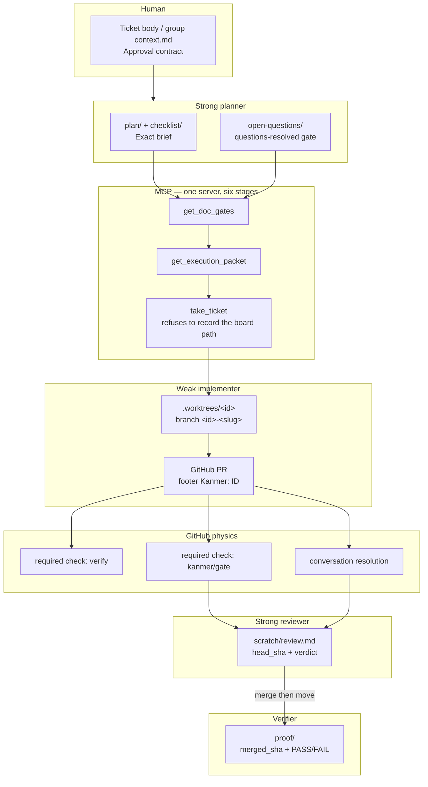

# Compiled workflow v1 — implementable design spec

| Field | Value |
|---|---|
| **Status** | Accepted (owner decisions recorded 2026-08-20) |
| **Date** | 2026-08-20 |
| **Author** | Grok Build (design pass after approved review) |
| **Verified against** | `main` @ `db7ed679`, `kanmer-board` @ `6bd2f362`, packaged MCP 0.3.3 at `C:\Users\PC\AppData\Local\Programs\Kanmer\resources\mcp\kanmer-mcp.cjs` |
| **Source proposal** | `Kanmer_Workflow_and_Reliability_Redesign_Clean.md` (19 Aug 2026, ~29 sections) |
| **Approved review** | session `plan.md` 20 Aug 2026 |
| **Governing follow-up** | New ADR-0016 (to be filed) + FRD deltas listed in §Governing docs. Does **not** reverse ADR-0001, 0002, 0005, 0009, 0011, or 0014. |

This is the **recommended target design**, not a restatement of the 2100-line source. Keep the operating idea; map it onto primitives Kanmer already has; cut until each item prevents a failure already observed.

---

## Overview

Kanmer already has six fixed stages, profile-scoped document gates, per-ticket folders, groups with `context.md`, a take/worktree model, and an MCP surface that both agents and the GUI share through the filesystem. What it does not have is a **compiled workflow**: a strong planner produces a bounded packet a weaker implementer can execute, a deterministic harness grades merge, and SHA-bound review/proof records the exact commit. Today those four audience contracts share one ticket body, GitHub can merge work the board would call blocked, and the live MCP `--root` (`.worktrees/kanmer`) is checked out to `doc-010-secure-mcp-tunnel` @ `b208107` with `boardSource: "default"` and **zero tickets** — while the canonical board on `kanmer-board` @ `6bd2f362` still has 175 tickets. That live incident is a **checkout** of the board worktree onto a ticket branch (DOC-010 already records `worktree: .worktrees/doc-010`). Ops repair + `get_status.boardWorktree` close it. `takeTicket` path-refuse is a related, smaller invariant (“never record the board path”); it would not have blocked this failure.

v1 is eight product/ops items on **existing** artifacts. No new stages, no parent/child storage, no new gated document types, no format-4 migration, no GitHub App, no expiring leases, no overlay engine, no role-scoped MCP binaries.

```mermaid
flowchart LR
  subgraph keep [Process + light product]
    A[Four audience contracts]
    B[Groups not parent/child]
    C[Templates in existing docs]
    D[GitHub as merge physics]
  end
  subgraph v1 [v1 product spine]
    E[Board worktree hard-guard]
    F["npm run verify + GHA + protect main"]
    G[kanmer/gate via CORE-024/025]
    H[SHA-bound review/proof records]
    I[get_execution_packet]
    J[expected_project + structured errors]
  end
  subgraph later [Deferred]
    K[Expiring leases]
    L[Risk overlay engine]
    M[Role-scoped MCP servers]
    N[RC freeze / merge queue / metrics]
  end
  keep --> v1 --> later
```



---

## Background & Motivation

### Current state (re-verified 2026-08-20)

| Fact | Evidence |
|---|---|
| Packaged MCP 0.3.3, `build: packaged`, sha256 `03196057…` | `get_status.server` |
| MCP `--root` = `<repo>/.worktrees/kanmer` (`rootSource: flag`) | `get_status.projectRoot` |
| That worktree HEAD is `doc-010-secure-mcp-tunnel` @ `b208107` | `git -C .worktrees/kanmer log -1` |
| Live board is synthesized default, **0 tickets** | `get_status.boardSource: "default"`, all `byStage` = 0 |
| Canonical board is `kanmer-board` @ `6bd2f362` (175 tickets, 41 non-done) | `git log -1 kanmer-board`; ticket tree on that branch |
| DOC-010 frontmatter records `worktree: .worktrees/doc-010` while `.worktrees/kanmer` sits on its branch | `git show kanmer-board:.kanmer/areas/docs/DOC-010/DOC-010.md` |
| `store.takeTicket` does not refuse the board path | `packages/core/src/store.ts` `takeTicket` (line 827) — checks type, `taken_at`, doc-gate, then writes |
| Skills forbid this in prose only | `kanmer-execute/SKILL.md` lines 47–50; `dispatch.ts` lines 80–82 comment |
| No `.github/` workflows; no `npm run verify` | repo root `package.json`; `.github` absent |
| PR #64 OPEN, not draft, `MERGEABLE`, `statusCheckRollup: []` | `gh pr view 64` |
| `main` and `kanmer-board` unprotected | GitHub API 404 on both protection endpoints |
| Stored `board.yml` omits `questions-resolved` and `fix.enter-review`; runtime injects both | `packages/core/src/board.ts` `injectFixEnterReview` + `resolveProfiles`; ADR-0011, ADR-0014 |
| No shipped profile uses `enter-verifying` | `packages/core/src/profiles.ts` `DEFAULT_PROFILES`; `BOUNDARIES` still lists it in `stages.ts` |
| Creation in any stage is ungated on purpose | FRD-002 G3, ADR-0010, `create_item` tool description |
| Review lives in `scratch/` and `gh pr merge` is outside the gate engine | `kanmer-review/SKILL.md` lines 40–76 |
| Proof is gathered on mutable `main` | `kanmer-verify/SKILL.md` lines 16–21; FRD-006 R2 |
| `kanmer-plan` unconditionally wants research+files | `kanmer-plan/SKILL.md` lines 8–22 |
| `kanmer-auto` §1 is per-ticket gates, §2 is “research everything” | `kanmer-auto/SKILL.md` lines 33–38 vs 50–56 and 119–122 |

### Pain

The source is right about the actual failure: four audiences (human approval, weak-agent execution, strong review, SHA-bound evidence) share one ticket surface, while GitHub remains able to merge work the board would call blocked. The live overlay is worse than the source saw: the **canonical board worktree was reused as a source checkout**, so every MCP session this host starts talks to an empty default board.

The source is wrong as a product spec. It folds diagnosis, grooming, GitHub ops, MCP redesign, GUI, evals, metrics, greenfield, and Pegasus-shaped overlays into one artifact, then proposes ~40 new surfaces while saying “do not add more process.” v1 is the subset that is load-bearing on *this* repo’s observed escape classes: wrong board worktree, unprotected `main`, merge outside gates, skill/doc drift, plugin bundle built in a worktree (SKILL-011), parallel-agent duplicate tickets.

---

## Goals & Non-Goals

### Goals (v1 spine — these ARE in scope)

1. **Board worktree integrity, three separate controls.** (a) **Ops PR 0** + `get_status.boardWorktree` close the live DOC-010 / empty-board incident (board path checked out to a ticket branch). (b) `takeTicket` refuses to *record* `.worktrees/kanmer` as a ticket `worktree` — a different hole; DOC-010 already stored `.worktrees/doc-010`. (c) MCP-017 stays its own `plugin:check` `isLinkedWorktree` unit-test ticket. v1 still cannot stop raw `git -C .worktrees/kanmer checkout`.
2. **Canonical `npm run verify`** wrapping the AGENTS.md §10 subset that is deterministic and always runnable.
3. **GitHub Actions PR workflow + protect `main`.** `kanmer-board`: no-force, no-delete; **no** PR-per-mutation.
4. **`kanmer check-pr` / `kanmer/gate`** built on CORE-024/025 (not a parallel epic). First check: linked ticket + unresolved `open-questions`. Second: ticket in Review, PR head recorded, no blocking `blocks` edges.
5. **SHA-bound review + proof records inside existing folders** (`scratch/`, `proof/`). No new gated doc types. Gates stay existence-based (ADR-0005).
6. **`get_execution_packet(id)`** — readiness + bundle, refuse if not ready. Extends FRD-010 enablement and MCP-019.
7. **Templates only:** approval in ticket body or group `context.md`; exact brief in existing `plan/`; `[pre-review]` / `[post-merge]` tags advisory.
8. **`expected_project` on mutations** with a compatibility window; structured errors `WRONG_PROJECT`, `REVISION_CONFLICT`, `GATE_BLOCKED`.

### Non-goals (do not sneak them back in)

- Expiring leases / heartbeats (FRD-016 `taken_at` + `force` stays).
- Materializing injected profiles into every `board.yml` (ADR-0014 injection stays; `get_status` may show stored vs effective as `compensated`, never `behind`).
- Hard content-gates on checklist tags (ADR-0011 stays: `questions-resolved` is the only content-reading requirement).
- Role-scoped MCP binaries.
- Automatic risk-overlay detectors.
- Frozen RC manifests, merge queue, metrics platform, golden-board eval harness.
- New GUI tab strip duplicating document tabs (view **modes** over the same files are in scope).
- Closing ungated `create_item` (FRD-002 G3).
- New stages or parent/child storage (ADR-0002, ADR-0001).
- GitHub App first.
- Pegasus migration / DI / runtime overlay **engine** as v1 of Kanmer itself.
- Format-4 migration.
- Making `expected_updated` / `expected_version` mandatory for GUI clients (the overwrite path is the conflict-resolution UX).
- New gated pipeline types (`approval`, `review`, `run`, `risk`).
- Encoding feature hierarchy in profiles; a profile per domain.

---

## Document split

The 29-section source is a reading-order dump. Durable homes:

| Source piece | Belongs in | Why |
|---|---|---|
| §2 operating model, §4 responsibility split, §5 groups-not-hierarchy, §22 non-goals | **ADR-0016** — “Compiled workflow; four audience contracts; no new hierarchy” | Cross-cutting, hard to reverse; matches ADR-0009 / 0002 / 0001 |
| Four views as **modes over existing files** | **FRD-003** (documents) + **FRD-019** (editor) | Not new doc types |
| `get_execution_packet`, readiness predicates, `expected_project` | **FRD-022** + **FRD-010** | Extends shipped surfaces |
| SHA-bound review attestation + typed proof *records* | **FRD-006** + this spec. Hard SHA gates would need an ADR-0005 amendment — **not in v1** | Type/source stay warnings |
| `npm run verify`, GHA, `kanmer/gate`, protect `main` | **Ops playbook** `docs/plans/compiled-workflow/` + tickets **CORE-024 / CORE-025** | GitHub is outside the gate engine by design (kanmer-review already says so) |
| Approval-contract + implementation-brief templates | **Skill assets** (`kanmer-plan/assets/`) | Must not become an 8th gated type |
| Skill rewrites (plan / execute / review / verify / auto) | **FRD-023** + skill PRs | ADR-0009: derive, never restate |
| Board-worktree hard-guard, `get_status` identity | **FRD-016** + **FRD-020** + **FRD-022 R5b** | Live incident; skills already claim this |
| §20 ticket disposition | **Appendix A** of this spec + a `kanmer-groom` run | Stales within days (already has) |
| §21 RC freeze / merge queue | **Appendix B** (deferred) | This repo releases from one laptop via `scripts/release.mjs` |
| §23 greenfield | Separate playbook, not this redesign | Different audience |
| §24 golden boards / §25 metrics | Horizon after v1 gate exists | Nothing to measure until the spine is real |
| §16.9 role-scoped MCP, §16.4 leases, §13 overlay *engine* | Explicit v1 non-goals | Contradict shipped FRD-016 / source’s own §22 |

This design document is the implementation source of truth for v1. In-tree ADR + FRD deltas are a product PR (see PR plan); they do not have to rewrite the 2100-line manifesto. **Do not** file the source as a governing doc.

---

## Proposed Design

### 1. Four audience contracts, mapped onto existing artifacts

The source’s mapping table is the best page in it. v1 uses it as the lead, with **no new files required**.

| Audience | Question | Artifact (already exists) | Writer | Reader |
|---|---|---|---|---|
| **Human (approval)** | What am I signing off? | Standalone: ticket body (`areas/<area>/<ID>/<ID>.md`). Grouped: group `context.md` (`groups/<ID>/context.md`, FRD-001 G2/G6) | Strong planner / human | Human; GUI Approval mode |
| **Weak implementer (execution)** | What exact job do I do, and when do I stop? | `plan/` (brief) + `checklist/` + `get_execution_packet` | Strong planner | Weak agent; GUI Execution mode |
| **Strong reviewer** | Does this diff match the brief on this SHA? | `scratch/review.md` via `set_ticket_doc` **replace** (FRD-003 T5 gate-exempt; `append_scratch` is notes only) + GitHub PR threads | Reviewer | Reviewer; `kanmer/gate`; GUI Review mode |
| **Verifier (evidence)** | Did the merged SHA actually work? | `proof/` (hard existence gate, ADR-0005 / FRD-006 R4) with SHA frontmatter | `kanmer-verify` | `move_item` into Done; GUI Evidence mode |

Supporting primitives that stay as they are:

- **Outcome grouping:** groups + membership on the ticket (ADR-0001). No parent/child field.
- **Dependency order:** `blocks:` / derived `blockedBy` (`packages/core/src/links.ts` `computeBlockedIds`).
- **Readiness oracle:** `get_doc_gates` → `KanmerStore.getDocGates` → `evaluateGateReport` (`packages/core/src/gates.ts`). Skills derive, never restate (ADR-0009).
- **Take / isolation:** `taken_at` + `branch` + `worktree` (FRD-016). `force` stays.
- **Scratch / reference / assets:** never satisfy a gate (`GATE_EXEMPT_DIRS` in `packages/core/src/profiles.ts`).



**Honesty about gates (FRD-002 G2a):** gates enforce *sequence*, not *causation*. An approval-hash freshness check (later) is sequence. “The brief is faithful to the approval” remains review’s job. v1 does not pretend otherwise.

---

### 2. Readiness as predicates on the six fixed stages

No new columns. ADR-0002 / FRD-007 stay: `backlog → preparing → implementing → review → verifying → done`. `BOUNDARIES` in `packages/core/src/stages.ts` is already:

```
leave-backlog | leave-preparing | enter-review | enter-verifying | enter-done
```

Four named readiness questions map onto those boundaries plus GitHub. They are **predicates**, not stages.

| Predicate | Means | Kanmer mechanical half | GitHub half | v1 hardness |
|---|---|---|---|---|
| **Ready to implement** | Weak agent may be dispatched / `take_ticket` into implementing | `leave-preparing` passable (`evaluateGateReport`); no unresolved `open-questions` (already in that boundary via `questions-resolved`); `get_execution_packet` succeeds | none | **Hard** on packet + dispatch enablement (FRD-010 R3). `create_item` stays ungated. |
| **Ready for review** | PR exists; ticket may enter Review | `enter-review` passable (post-implementation-report + questions-resolved on `feature`/`fix`) | PR opened, `Kanmer: ID` footer | Existence-based as today. Recording `head_sha` in scratch is **advisory** until `kanmer/gate` expansion. |
| **Ready to merge** | GitHub may land the PR | Ticket in `review`; `kanmer/gate` green | Required `verify` + `kanmer/gate` + conversation resolution + no force | **Hard on GitHub.** `move_item` cannot stop `gh pr merge` (documented, SKILL-012 measured). |
| **Ready for Done** | Merged result verified | `enter-done` passable (≥1 `proof/` doc + questions-resolved) | n/a | Existence-based (ADR-0005). SHA / PASS vs INCONCLUSIVE are **advisory records** in v1. |

#### `enter-verifying` and “PR is merged”

No shipped profile declares `enter-verifying` (`DEFAULT_PROFILES` in `packages/core/src/profiles.ts`). The honest Kanmer complement to GitHub merge physics would be: *move Review → Verifying only when the PR is merged.*

v1 **does not inject** `enter-verifying` onto shipped profiles (that would be a second ADR-0014-shaped injection, changing `collapsesPipeline` arithmetic for `feature`/`fix`). Recommended default:

- Keep the unused boundary reserved.
- Skills keep the documented order: merge, then `move_item verifying` (`kanmer-review/SKILL.md` lines 95–101).
- `kanmer/gate` is what makes merge physically impossible when the ticket is not ready.
- An operator *may* add `enter-verifying` on `custom` or a future profile using an existence-based marker if they want; the marker must not be a new gated type. A later ADR would be required to make `pr-merged` a pseudo-requirement (it would read GitHub or ticket frontmatter, which is a new class of evidence — not a document-existence check, and not `questions-resolved`).

Do not put git/network into `@kanmer/core` to prove merge. Core stays filesystem-bound.

#### Ready-to-implement vs `create_item`

Dispatch and `get_execution_packet` refuse. `create_item` does not. Historical backfill (FRD-002 G3) and “file the ticket in Review because the PR already exists” remain legal. Readiness blocks **execution**, not birth.

#### Advisory “decide/investigate” scan

Planner skill warns if Required changes in `plan/` still contain those verbs. **Not a parser-gate.** Hard-gating checklist/plan content needs an ADR-0011 amendment and a second parser; that is a non-goal.

---

### 3. Board worktree integrity

This is the highest-value reliability bug in the repo today. **Split the claims — do not treat the store guard as the DOC-010 fix.**

| Control | What it actually stops | What it does *not* stop |
|---|---|---|
| **PR 0 (ops checkout)** | Live incident: `.worktrees/kanmer` is on `doc-010-secure-mcp-tunnel` and MCP serves an empty default board | Future `git checkout` in that directory |
| **`get_status.boardWorktree`** | Makes the same class of failure *visible* next session | The checkout itself |
| **`takeTicket` path refuse** | Recording `worktree: .worktrees/kanmer` (or the absolute board/`--root` path) on a ticket | `git -C .worktrees/kanmer checkout <ticket-branch>` — `takeTicket` only writes the string it is given (`store.ts:858`) and never runs git. Live DOC-010 already recorded `.worktrees/doc-010`. GUI Take sends only `{ branch }` (`App.tsx:698`) and stays allowed. |

v1 still cannot stop raw git in the board worktree. That remains skill prose + `dispatch.ts` cwd (already listed under “Not refused”).

**Invariant (FRD-020 R1, already specified, not enforced at take):** for a Git project the board root is `<repo>/.worktrees/kanmer` on the configured branch (default `kanmer-board`). MCP `--root` points there. Agent execution and `git worktree add` use the **source** root. `dispatch.ts` already refuses to default cwd to `store.paths.projectRoot` for this reason (lines 80–82). Skills already say “never create, switch, push or remove that one” (`kanmer-execute/SKILL.md` 47–50). `KanmerStore.takeTicket` does none of this.

#### Where to refuse (the smaller hole)

**`KanmerStore.takeTicket`** (`packages/core/src/store.ts`). Path comparison only — no git subprocess in core (FRD-002 G2a explicitly rejected the first git spawn in `@kanmer/core`). GUI Take (`App.tsx` → `CH.takeTicket`) and MCP `take_ticket` both go through this method, so one refuse covers both.

```ts
// packages/core/src/worktree-guard.ts (new, pure)
import { isAbsolute, join, normalize, resolve } from "node:path";

export const BOARD_WORKTREE_SEGMENT = "kanmer";

export function isForbiddenTicketWorktree(
  worktree: string,
  opts: { projectRoot: string; repoRoot: string },
): boolean {
  const abs = resolveWorktree(worktree, opts.repoRoot);
  const board = normalize(resolve(opts.projectRoot));
  const canonical = normalize(join(resolve(opts.repoRoot), ".worktrees", BOARD_WORKTREE_SEGMENT));
  return pathsEqual(abs, board) || pathsEqual(abs, canonical);
}

function resolveWorktree(worktree: string, repoRoot: string): string {
  const n = worktree.replace(/[/\\]+$/, "");
  return normalize(isAbsolute(n) ? n : join(resolve(repoRoot), n));
}

function pathsEqual(a: string, b: string): boolean {
  const na = normalize(a);
  const nb = normalize(b);
  return process.platform === "win32" ? na.toLowerCase() === nb.toLowerCase() : na === nb;
}
```

Inside `takeTicket`, after the existing `taken_at` check and **before** the doc-gate / write:

```ts
if (input.worktree !== undefined) {
  if (isForbiddenTicketWorktree(input.worktree, {
    projectRoot: this.paths.projectRoot,
    repoRoot: this.paths.repoRoot,
  })) {
    throw new Error(
      `Refusing to take "${id}" in the board worktree (${input.worktree}). ` +
        `Ticket worktrees are .worktrees/<id>; .worktrees/kanmer is the board (FRD-016 / FRD-020).`,
    );
  }
}
```

Taking **without** `worktree` (GUI currently sends only `{ branch }` — `App.tsx:698`) stays allowed. This refuse is “never *record* the board path,” not “never check the board worktree out to a ticket branch.”

**Not refused in v1 (skill + dispatch only):**

- `git worktree add .worktrees/kanmer …` from a shell. Core does not spawn git and should not start.
- `dispatchTicket` cwd. Already required to be `sourceRoot`; add a debug assertion that `resolve(sourceRoot) !== resolve(store.paths.projectRoot)` when a board worktree exists, but do not block non-Git colocated boards.
- `releaseTicket` / `closeout` cleanup of `.worktrees/kanmer`. Skill prose already forbids it; a later `ticket_workspace` tool (source §16.10) is a non-goal.

**Tests:** `packages/core/src/store.test.ts` — take with `.worktrees/kanmer`, with the absolute `projectRoot`, and with mixed-separator Windows paths, all throw; take with `.worktrees/doc-010` succeeds. MCP-017 (`isLinkedWorktree` in `scripts/check-plugin-sync.mjs`) is a **different** guard; do not hitchhike its tests onto this PR.

#### `get_status` shape (board-worktree health)

Git is allowed in the **MCP server and Electron main**, not in core (FRD-002 G2a). GUI main does **not** depend on `@kanmer/mcp-server`, and there is no third package. **Duplicate** the ~20-line git exec — `inspectBoardWorktree(boardRoot, expectedBranch)` in `apps/gui/src/main/kanmerGit.ts` (next to existing `currentBranch` at line 36) **and** the same helper in `packages/mcp-server/src/board-worktree.ts`. Comment each as a pair. Do not extract `packages/git` in v1.

MCP `get_status` adds:

```ts
type BoardWorktreeHealth = {
  path: string;
  expectedBranch: string;      // default "kanmer-board"; GUI setting when known
  actualBranch: string | null; // symbolic-ref, or null if detached
  onBoardBranch: boolean;
  boardSource: "file" | "default";
  ticketCount: number;         // sum of counts.byStage — 0 + default is the live bug
  repair: string | null;       // null when healthy
};
```

Live result, if this field existed today:

```json
{
  "path": "C:\\Users\\PC\\Documents\\GitHub\\kanmer\\.worktrees\\kanmer",
  "expectedBranch": "kanmer-board",
  "actualBranch": "doc-010-secure-mcp-tunnel",
  "onBoardBranch": false,
  "boardSource": "default",
  "ticketCount": 0,
  "repair": "git -C .worktrees/kanmer checkout kanmer-board  (only if clean). Ticket DOC-010 belongs in .worktrees/doc-010."
}
```

`onBoardBranch: false` is **informational on `get_status`** (read-only). It does not block mutations by itself in v1 — the agent that already has a wrong root would then be unable to repair via MCP. Repair is an **ops procedure** (PR 0), pointed at by `repair`. After repair, `boardSource` becomes `"file"` and counts return.

MCP does not currently know the GUI’s configured branch name (`settings.ts` default `"kanmer-board"`). v1 default: assume `kanmer-board` unless `KANMER_BOARD_BRANCH` is set (optional env, not a new flag on every tool). Do not read Electron settings from the packaged MCP.

#### Repair ops (PR 0 — not a product PR)

This is an **orphan-branch swap**, not a same-tree checkout. Current `.worktrees/kanmer` is a **full source tree** on `doc-010-secure-mcp-tunnel` @ `b208107` (clean porcelain today). `kanmer-board` is an orphan **board-only** tree. Checking it out will **delete every source file** in that worktree and leave `.kanmer/` from the board branch. Intended.

DOC-010 claims `.worktrees/doc-010`. The ignored shadow `.kanmer/data/activity.jsonl` is why `exists: true` && `boardSource: "default"` — `git status --porcelain` will not show it.

Procedure:

1. `git -C .worktrees/kanmer status --porcelain --ignored` — if dirty (non-ignored), stop. Record the files. Do not checkout over local work. The ignored `activity.jsonl` is expected.
2. If a worktree `.worktrees/doc-010` does not exist, `git worktree add .worktrees/doc-010 doc-010-secure-mcp-tunnel` from the **source** root (or recreate from the branch). Must happen **before** step 3 so the ticket branch still has a worktree.
3. `git -C .worktrees/kanmer checkout kanmer-board`. Git will refuse if another worktree already holds `kanmer-board` (none does today — `git worktree list` shows only main + this one). If checkout complains about untracked `.kanmer`, move `activity.jsonl` aside and retry.
4. Confirm `get_status.boardSource === "file"` and `counts` match ~175 tickets (37 backlog / 3 preparing / 1 review / 134 done at `6bd2f362`).
5. Confirm MCP `--root` still points at the **same path** `.worktrees/kanmer` (Connect registration is path-stable; FRD-020 R5). The worktree contents change; the path must not.
6. Do **not** merge PR #64 as part of this repair. See Decisions (owner, 2026-08-20) #4.

Risk if skipped: every subsequent agent session writes to a shadow board; `kanmer-board` and the live MCP diverge until someone notices empty columns.

#### MCP-017 vs the new guard (do not conflate)

| Guard | What it prevents | Where | Ticket |
|---|---|---|---|
| `isLinkedWorktree` in `plugin:check` | Certifying a bundle built in `.worktrees/<id>` (SKILL-011) | `scripts/check-plugin-sync.mjs` | MCP-017 (unit-test it) |
| Forbidden ticket worktree | Recording the board path as a ticket `worktree` (not the live DOC-010 checkout) | `store.takeTicket` | This spec, PR 1 |
| `plugin:check` refuses in a worktree | Same as first; no env-var bypass (MCP-007) | same script | already shipped |

MCP-018 (“test module resolution, not the worktree path”) is a later refinement of guard 1, not a substitute for guard 2. MCP-017’s unit tests are a **parallel** `test:scripts` PR, not a rider on PR 1.

---

### 4. `npm run verify` composition

`package.json` has no `verify` script. `scripts/release.mjs` already sequences a heavier gate for cutting a release (build, `plugin:check`, tests, both smokes, `verify:agents-block`, `verify:skills`, typecheck across workspaces). v1 extracts the **PR-time** subset so GitHub can require it without packing an installer.

AGENTS.md §10 mapped to always-on vs opt:

| §10 item | In `npm run verify`? | Why |
|---|---|---|
| 1. `npm test` (core + GUI + `test:scripts` + `check:manual`) | **Yes** | Cheap, deterministic |
| 2. `smoke.mjs` + `smoke-protocol.mjs` | **Yes** | Server contract |
| 3. `npm run typecheck` (all workspaces, `--if-present`) | **Yes** | vitest does not typecheck; this is what let `c8b94a4` ship |
| 4. `npm run build -w @kanmer/gui` | **No** (PR job may add later) | Heavy; typecheck covers the GUI. Release still builds. |
| 5. `KANMER_SMOKE` Electron boot | **No** | Needs a display/user-data-dir; not GHA-default |
| 6. `plugin:build` + `plugin:check` | **`plugin:check` yes, after `npm run build`** | Requires the main checkout (gotcha 8). CI clones the PR branch as the main working tree, so this is valid. Do **not** run `plugin:build` in CI — it would rewrite `plugins/kanmer/mcp/kanmer-mcp.cjs` and fail the dirty-tree rule; `plugin:check` compares committed bytes to a fresh **build**, which is the test we want. |
| 7. Live GUI + agent round-trip | **No** | Manual |
| 8. `verify:agents-block` | **Yes** | Fast; catches Connect rewriting a v2 block |
| 9. `dist:check` | **No** | Release-only (updater packaging) |

`smoke:discovery` is cheap and should be included (ADR-0012 is load-bearing for the board-worktree layout).

Root `package.json`:

```json
"verify": "node scripts/verify.mjs"
```

`scripts/verify.mjs` is dependency-free (same family as `release.mjs`): `execSync` each step, refuse with a named fix, exit 1 on first failure. **One step array, used by both `npm run verify` and `release.mjs`:**

```js
// scripts/verify.mjs — exported as VERIFY_STEPS; release.mjs imports and then continues with bump/pack
const VERIFY_STEPS = [
  "npm test",                                          // includes check:manual via the test script
  "npm run typecheck",                                 // all workspaces
  "npm run build",                                     // core + mcp-server standalone; plugin:check needs it
  "node packages/mcp-server/src/smoke.mjs",
  "node packages/mcp-server/src/smoke-protocol.mjs",
  "npm run smoke:discovery",                           // new vs today's release GATE
  "npm run verify:skills",
  "npm run verify:agents-block",
  "npm run plugin:check",
];
```

This **is** a behaviour change of the release rail (`release.mjs:213–244` today is `build → plugin:check → test → smokes → verify:agents-block → check:manual → verify:skills → typecheck`). Do not advertise it as a no-op. Deltas: order flips; `smoke:discovery` is added; `check:manual` is **not** listed separately (it already runs inside `npm test` — drop the duplicate `GATE` entry). Dist/pack/publish after the array stays in `release.mjs` only.

If `plugin:check` is invoked from a linked worktree it already refuses (MCP-007). Document in AGENTS.md §6: **`npm run verify` is the PR check; `scripts/release.mjs` is verify + bump/pack; do not invent a third pyramid.**

Expected duration: on this machine, tests + typecheck + smokes are the existing local loop; adding `plugin:check` after build is what `release.mjs` already pays. Target for GHA: **under 10 minutes** on `windows-latest` (the GUI vitest suite is the long pole). Do not switch to `ubuntu-latest` as the only job — Windows-specific tests (`kanmerGit.test.ts`, path separators) are the product.

---

### 5. GitHub Actions + branch protection

**Product vs ops.** The workflow file is product (in-tree, reviewed). Protection settings are ops (GitHub UI/API, one-way, not fully representable as a file without a GitHub App or `repository_rulesets`). Both are v1; only the workflow is a mergeable PR.

#### Workflow (product)

Default shell on `windows-latest` is **PowerShell**. Set `defaults.run.shell: bash` on the workflow (GitHub-provided bash exists on `windows-latest`) so `$RUNNER_TEMP` expands. Do **not** mix `$RUNNER_TEMP` (bash) with `$env:GITHUB_EVENT_PATH` (PowerShell) in one job.

**PR 3 ships the `verify` job only.** Do not add a `kanmer-gate` stub in that PR — an operator flipping protection to “all jobs” would then require a check that does not exist yet. Playbook: never tick a check in Settings that has not appeared once.

**PR 3** — `.github/workflows/pr.yml`:

```yaml
name: verify
on:
  pull_request:
    branches: [main]
    types: [opened, synchronize, reopened, ready_for_review]
permissions:
  contents: read
defaults:
  run:
    shell: bash
jobs:
  verify:
    runs-on: windows-latest
    steps:
      - uses: actions/checkout@v4
      - uses: actions/setup-node@v4
        with:
          node-version: "20"
          cache: npm
      - run: npm ci
      - run: npm run verify
```

**PR 5 adds** a second job with the **same workflow file**, job id `kanmer-gate` (GitHub’s required-check name is usually `kanmer-gate`; record the string the UI actually shows in the playbook after the first green PR — it may be `verify / kanmer-gate`):

```yaml
  kanmer-gate:
    runs-on: windows-latest
    steps:
      - uses: actions/checkout@v4
        with:
          fetch-depth: 0
      - uses: actions/setup-node@v4
        with:
          node-version: "20"
          cache: npm
      - run: npm ci
      - run: npm run build:core
      - name: Fetch board branch
        run: git fetch origin kanmer-board:refs/remotes/origin/kanmer-board
      - name: Materialise board
        run: git worktree add "$RUNNER_TEMP/kanmer-board" origin/kanmer-board
      - name: kanmer/gate
        run: node packages/mcp-server/src/check-pr.mjs --board "$RUNNER_TEMP/kanmer-board" --event "$GITHUB_EVENT_PATH"
```

`--event` maps the Actions payload as follows (implemented in `check-pr.mjs`, **not** in `evaluateMergeGate`):

| Event field | `MergeGateInput.pr` |
|---|---|
| `pull_request.number` | `number` |
| `pull_request.head.sha` | `headSha` |
| `pull_request.head.ref` | `headRef` |
| `pull_request.body` (empty string if null) | `body` |

Draft PRs (`pull_request.draft === true`): still run the check (do not special-case). Triggers: `opened`, `synchronize`, `reopened`, `ready_for_review` — a new commit (`synchronize`) must re-evaluate SHA / questions. If `--event` is missing `pull_request`, exit 2 (the *check* could not run) distinct from exit 1 (`!ok`).

Check names that branch protection will require: `verify` (PR 4) and `kanmer-gate` (ops step after PR 5’s job has posted once). **Do not rename jobs** after protection is on — GitHub matches by name.

The board is an **orphan branch in the same repo**. CI does not need a GitHub App, a second checkout of a different repository, or the GUI. It needs `fetch-depth: 0` or an explicit fetch of `kanmer-board`. If that fetch fails (fork PRs from outsiders without the board branch): **fail closed** on this repository (the board is public-in-the-same-repo); document a `continue-on-error` escape only if we ever accept external forks. This repo does not.

`kanmer-board` pushes must **not** trigger this workflow (`on.pull_request.branches: [main]` only). Board sync is `chore(kanmer): sync board …` on a different branch; requiring PR+verify for every ticket move is exactly what source §10.2 correctly rejects.

#### Protection (ops)

| Branch | Require PR | Required checks | Conversation resolution | Force push | Delete |
|---|---|---|---|---|---|
| `main` | yes | `verify`; add `kanmer-gate` when the job exists | yes | no | no |
| `kanmer-board` | **no** | none (optional later: a lightweight board-validator on push) | n/a | **no** | **no** |

Who can push `kanmer-board`: the operator and the GUI sync identity on this machine. Do not invent a GitHub App “Kanmer sync” user in v1. Restricting pushes to a bot is later.

**One-way door:** turning protection on is cheap to do and expensive to undo in social terms (every future PR pays). Rollback of the *workflow* is revert the file; rollback of *protection* is a human in Settings. Record the applied settings in `docs/plans/compiled-workflow/playbook.md` so they can be reapplied if GitHub ever drops them.

Do not enable a merge queue (source §21). `release.mjs` remains the release process. There is still no CI on tag push (AGENTS.md §11); a tag-push GHA is a follow-up, not v1.

---

### 6. `kanmer check-pr` / `kanmer/gate` (CORE-024 / CORE-025)

Not a parallel epic. CORE-024 already `blocks` CORE-025. Convert the spikes into this implementation once the mechanism is chosen — the choice is made here.

#### How it reads the board without the GUI

`KanmerStore` is filesystem-only. Point it at a materialised `kanmer-board` worktree:

```ts
const store = new KanmerStore(boardRoot); // boardRoot has `.kanmer/`
// READ-ONLY. Do not call store.init() / ensureInit() — that would write a
// skeleton into the fetched board worktree.
const item = await store.getItem(ticketId);
const report = await store.getDocGates(ticketId);
```

Reuse `countCheckboxes(ticketDir, "open-questions", { stopAtParked: true })` (`packages/core/src/docpaths.ts`) — CORE-024’s “do not re-implement the parse.”

Fill `blockedByOpen` from `getLinkGraph(store, ticketId).blockedBy` (`links.ts` `LinkGraph.blockedBy`, derived blockers) filtered to ids whose `status !== lastStageId` (`"done"`) and not archived. **Do not** use `computeBlockedIds` here: that helper returns the **blocked targets** of live `blocks:` edges (`links.ts:61–72`), which is the opposite direction of `DEPENDENCY_BLOCKED` (“X is blocked *by* …”).

**Do not** put this in dependency-free `scripts/` as a second copy of the checkbox regex. New module `packages/core/src/merge-gate.ts`, exported from `packages/core/src/index.ts`. CLI wrapper `packages/mcp-server/src/check-pr.mjs` (same shape as `smoke.mjs`: runnable with `node`, imports `@kanmer/core` after `npm run build:core`). Root script: `"check-pr": "node packages/mcp-server/src/check-pr.mjs"`.

Ticket resolution, in order (footer preferred):

1. PR body footer `Kanmer: <ID>` — `kanmer-execute` already writes this (`SKILL.md` line 91).
2. Else branch `<id>-<slug>`: `/^([A-Z0-9]{2,6}-\d+)/i` (prefixes are `/^[A-Z0-9]{2,6}$/` in `types.ts:26`; letters-only would reject a user area `V2` / `A1`).
3. Else **fail** `NO_TICKET` **on this repository**. That is a decision, not “the CORE-024 approach”: CORE-024’s spike verification asked to enumerate cases the check must **not** fire (no ticket, board unreachable, questions parked). v1 on *this* repo: no ticket → fail; parked questions → pass (`stopAtParked`); board fetch fail → fail closed. User-repo auto-install and advisory-on-no-ticket stay on CORE-024 as later. Reprofile CORE-024/025 from `spike` to `chore`/`fix` when taking them (a `spike` packet refuse would block the tickets that *are* the work).

#### Minimum then expansion

```ts
// packages/core/src/merge-gate.ts
export type MergeGateSeverity = "fail" | "warn";

export interface MergeGateFinding {
  code: string;
  severity: MergeGateSeverity;
  message: string;
}

export interface MergeGateInput {
  item: Item | null;
  ticketId: string | null;
  pr: { number: number; headSha: string; headRef: string; body: string };
  unresolvedQuestions: number;     // countCheckboxes stopAtParked, 0 if no item
  blockedByOpen: string[];         // getLinkGraph.blockedBy, status !== lastStage, not archived
  reviewHeadSha: string | null;    // parsed from scratch/review.md frontmatter; null if absent
}

export interface MergeGateResult {
  ok: boolean;                     // true iff no severity:"fail"
  findings: MergeGateFinding[];
}

export function evaluateMergeGate(input: MergeGateInput, phase: 1 | 2): MergeGateResult {
  const findings: MergeGateFinding[] = [];

  // --- CORE-024 / phase 1 (required) ---
  if (!input.ticketId || !input.item) {
    findings.push({
      code: "NO_TICKET",
      severity: "fail",
      message: "PR does not name a Kanmer ticket (footer `Kanmer: <ID>` or branch `<id>-<slug>`).",
    });
    return { ok: false, findings };
  }
  if (input.unresolvedQuestions > 0) {
    findings.push({
      code: "OPEN_QUESTIONS",
      severity: "fail",
      message: `${input.ticketId} has ${input.unresolvedQuestions} unticked open-question(s). Tick or park under "## Parked (explicitly deferred)". Gates cannot stop gh pr merge; this check can.`,
    });
  }

  if (phase < 2) return { ok: findings.every((f) => f.severity !== "fail"), findings };

  // --- CORE-025 / phase 2 ---
  if (input.item.status !== "review") {
    findings.push({
      code: "WRONG_STAGE",
      severity: "fail", // this-repo default; other people's repos may warn (Open Question 7)
      message: `${input.ticketId} is in "${input.item.status}", not review. Pipeline was skipped or the PR is early.`,
    });
  }
  if (input.blockedByOpen.length) {
    findings.push({
      code: "DEPENDENCY_BLOCKED",
      severity: "fail",
      message: `${input.ticketId} is blocked by ${input.blockedByOpen.join(", ")}.`,
    });
  }
  if (input.reviewHeadSha && input.reviewHeadSha !== input.pr.headSha) {
    findings.push({
      code: "STALE_REVIEW",
      severity: "warn", // advisory until SHA records are routine
      message: `scratch/review records head_sha ${input.reviewHeadSha}; PR head is ${input.pr.headSha}.`,
    });
  }
  if (!input.reviewHeadSha) {
    findings.push({
      code: "NO_REVIEW_RECORD",
      severity: "warn",
      message: `No scratch/review attestation yet. Advisory in v1 (ADR-0005: hard proof gate is existence only).`,
    });
  }
  return { ok: findings.every((f) => f.severity !== "fail"), findings };
}
```

Phase 1 ships as the required `kanmer-gate` job (PR 5). Phase 2 enables the extra fails behind the same job (PR 6) after SHA records exist (PR 7 can land in either order relative to 6 for the warn-only SHA clause).

**Explicitly not in v1 `kanmer/gate`:** checklist completeness, “PIR mentions every changed file,” approval-hash freshness, LLM scoring, governing-doc path still exists (nice but needs the PR tree, not the board tree). CORE-025’s spike write-up should reject these with the “did it happen on a real board?” test.

#### CLI output

stdout: JSON `MergeGateResult` (for annotations). Also emit GitHub workflow commands:

```
::error title=OPEN_QUESTIONS::CORE-024 has 2 unticked open-question(s)…
```

Exit 1 if `!ok`. `check-pr.mjs` must not print those to stdout mixed with JSON — JSON on stdout, workflow commands on stderr (or the other way around, but pick one and test it). Prefer: JSON stdout, `::error::` stderr, matching MCP’s “never write non-protocol bytes to stdout” discipline even though this is not MCP.

#### Relationship to the GUI

None at runtime. The GUI never runs this. The required check is the merge physics. GUI-090 (surface `get_status.repo` in the GUI) is the analogous health surface for staleness, not for PR gates.

---

### 7. SHA-bound records (no new gated types)

ADR-0005 / FRD-006: the **hard** gate remains “≥1 markdown under `proof/`.” Type, source, SHA, PASS/FAIL are records and warnings.

#### Locations

| Record | Path | Why this folder |
|---|---|---|
| Review attestation | `scratch/review.md` | Format-3 path (`store.appendScratch` comment at 1378–1380). **gate-exempt** so a review cannot satisfy `enter-done`. Writer is `set_ticket_doc` **replace**, not `append_scratch`. |
| Proof record | `proof/proof.md` (or any `proof/*.md`) | Already the Done gate. Structured YAML **frontmatter** plus the existing prose body. |

Do **not** add `scratch/review.yml` as a second file unless the markdown-with-frontmatter path fails. One file per concern; gray-matter already parses ticket frontmatter (`packages/core/src/frontmatter.ts`). Proof docs currently have no required frontmatter; adding optional keys is not a format bump (format is folder layout, ADR-0008).

Optional additional run log (`scratch/run.md`) is **not** required in v1. Source §7.3’s run YAML is a generated record to budget later.

#### Schemas (frontmatter)

Review (`scratch/review.md`):

```yaml
---
kind: review-attestation
pr: 64
head_sha: b2081079…          # full SHA
verdict: pass | needs-changes
reviewer: codex-review        # actor; "self" if author==reviewer (kanmer-review already requires saying so)
independent: false
plan_hash: "a1b2c3d4e5f67890" # contentVersion(plan/plan.md) — same 16-hex as get_ticket_doc.version
ticket_updated: 2026-08-18T…  # item.updated timestamp at review time, not a hash
findings: []                  # optional; see below
---
```

v1 `findings` may stay prose in the body (today’s Changes / Comments / Disposition / Verdict). If structured findings are written, use:

```yaml
findings:
  - id: PR64-F03
    source: github-review
    severity: P2
    path: docs/manual/connect.md
    head_sha: b208107…
    status: open   # open | fixed | rejected-with-reason | accepted-risk | deferred-to-ticket | obsolete-after-change
    disposition: null
    remediation_ticket: null
```

Structured findings are **advisory**. `kanmer/gate` phase 2 does not parse P1/P2 policy (that is the source’s merge-queue-sized policy). Conversation resolution on GitHub is the P1/P2 physical stand-in.

Proof (`proof/proof.md`):

```yaml
---
kind: proof-record
merged_sha: 6bd2f362…         # exact commit verified; NOT "whatever main is now"
environment: windows-11-local
verified_at: 2026-08-20T…
result: PASS | FAIL | INCONCLUSIVE | NOT_APPLICABLE | WAIVED_BY_OPERATOR
attempts:
  - result: FAIL
    at: …
    note: "command died"
  - result: PASS
    at: …
---
```

Keep failed attempts (source §12.2). `INCONCLUSIVE ≠ PASS`. Soft in v1: a proof file with `result: FAIL` still **exists**, so `enter-done` passes. Reviewers and `kanmer-verify` must not write FAIL and then move; that is skill choreography, not a new content-gate.

#### Who writes what

`append_scratch` is `fs.appendFile` (`store.ts:1362–1384`) and **cannot** rewrite frontmatter. `setDoc` writes caller bytes after trim (`store.ts:964–968`) and does **not** strip YAML — the “Plain Markdown, no frontmatter” line is a tool blurb, not a parser. v1 writer for attestations is **`set_ticket_doc` replace** of the whole file each pass (`append: false`). `append_scratch` stays for running notes (`scratch/notes.md`, execute progress).

| Field | Writer | When |
|---|---|---|
| `scratch/review.md` (whole file) | `kanmer-review` via `set_ticket_doc id scratch/review.md` **replace** | Every review pass (rewrites `head_sha`) |
| `head_sha` | reviewer, from `gh pr view --json headRefOid` | same |
| `proof/proof.md` frontmatter | `kanmer-verify` via `set_ticket_doc` replace | After merge, in a detached worktree |
| Ticket `prs: ["64"]` / `commits: []` | `kanmer-execute` already; verify may append merged SHA to `commits` | existing |

**`plan_hash` algorithm (one, used by review and packet):** `contentVersion` of the plan **index** `plan/plan.md` — `sha256(utf8).hex.slice(0, 16)` (`packages/core/src/io.ts:11–12`), identical to `get_ticket_doc`’s `version`. Not a concatenation of the folder. Missing index → omit / `null`.

`merge-gate.ts` reads `head_sha` with **gray-matter** (already a core dependency via `frontmatter.ts`), not a `head_sha:` regex (false-matches body prose). Tolerate missing frontmatter as already stated.

**PR 7 also fixes the two stale MCP blurbs** so agents write the format-3 path: `get_ticket_doc` still says `scratch-<slug>.md` (`index.ts:453`); `append_scratch` still says `scratch-<slug>.md` (`index.ts:883–886`). Reality is `scratch/<slug>.md`. Update those descriptions; do not add a gated type.

#### Verify on exact merged SHA

`kanmer-verify/SKILL.md` today: checkout merged `main` in the main checkout or the ticket worktree, never `.worktrees/kanmer`. v1 change:

```text
git fetch origin
git worktree add --detach .worktrees/verify-<id>-<merged_sha> <merged_sha>
# run evidence there
# do not update main in the main checkout as a side effect
```

`merged_sha` comes from `gh pr view <n> --json mergeCommit`. If the PR is not merged, this skill is running too early — stop.

---

### 8. `get_execution_packet(id)`

One composite **read**. Extends FRD-010 R3 (Execute disabled until Preparing gates pass) and MCP-019 (multi-doc get). It does **not** wait on MCP-019: internally it calls `getDoc` / `getDocWithVersion` per needed type. MCP-019 remains a worthwhile generalisation for other callers; the packet is the weak-agent entry point.

#### Input / output

```ts
// MCP tool get_execution_packet
// annotations: { readOnlyHint: true }
// input: { id: string }

interface PacketDoc {
  path: string;                      // type-relative, e.g. "plan/plan.md"
  content: string;
  version: string;                   // contentVersion — io.ts:11–12
}

interface ExecutionPacket {
  id: string;
  project: ProjectIdentity;          // same block as get_status.project (see §9)
  item: {
    title: string;
    status: string;
    profile: string;
    area: string | undefined;
    groups: string[];
    refs: string[];
    body: string;                    // approval surface for standalone tickets
    taken: { assignee?: string; taken_at?: string; branch?: string; worktree?: string } | null;
  };
  groupContext: { id: string; title: string; context: string | null }[];
  // Folder *indexes* via existing getDocWithVersion(id, type) → plan/plan.md etc.
  plan: PacketDoc | null;
  checklist: PacketDoc | null;
  files: PacketDoc | null;           // files/files.md index only; null if absent (chore OK)
  // All markdown under plan/ | checklist/ | files/ (MCP-019 compose point).
  // Indexes repeat here as listings; extra files have path+version only (no content).
  docs: { type: "plan" | "checklist" | "files"; path: string; version: string }[];
  hashes: {
    plan: string | null;             // === plan.version (contentVersion of the index)
    checklist: string | null;
    ticketUpdated: string;           // item.updated ISO timestamp — not a hash
  };
  gates: GateReport;                 // evaluateGateReport verbatim
  stopCondition: string;
  commandsHint: string[];
  ready: true;
}

interface PacketRefusal {
  ready: false;
  code: "GATE_BLOCKED";
  message: string;
  gates: GateReport | null;          // null only when locateItem failed
  missing: string[];                 // unmet leave-preparing reqs; [] for occupancy / spike
}
```

Format-3 types are **folders** (FRD-003 T1). Bare `getDocWithVersion(id, "plan")` resolves the index `plan/plan.md` (`store.ts` 891–893). That is the `plan` / `checklist` / `files` object. Extra markdown under the type is listed in `docs` (content omitted — fetch via `get_ticket_doc` / MCP-019).

**Heading scrape (ATX only, no Setext):**

```ts
function extractAtxSection(md: string, title: string): string | null {
  const want = title.trim().toLowerCase();
  const lines = md.split(/\r?\n/);
  let start = -1;
  for (let i = 0; i < lines.length; i++) {
    const m = /^(#{1,6})\s+(.+?)\s*$/.exec(lines[i]);
    if (m && m[2].trim().toLowerCase() === want) { start = i + 1; break; }
  }
  if (start < 0) return null;
  const body: string[] = [];
  for (let i = start; i < lines.length; i++) {
    if (/^#{1,6}\s+/.test(lines[i])) break;
    body.push(lines[i]);
  }
  return body.join("\n").trim() || null;
}
// stopCondition = extractAtxSection(plan.content, "Stop condition")
//   ?? "Stop at the checklist; do not merge; do not start another ticket.";
// commandsHint = fenced-code bodies (``` … ```) inside extractAtxSection(..., "Commands") ?? [];
```

Refusal conditions (first match wins):

1. No ticket, not a ticket, `locateItem` null, or `loc.kind === "v1"` (legacy type-folder layout). Internally `kind: "v2"` means the **areas folder layout**, including format 3 — do not branch on `detectFormat() === 2`. Write “ticket folder layout (`locateItem.kind === "v2"`, format ≥ 2).”
2. Profile is `spike` — **dominates; do not also run 3–5.** Research is the deliverable. `GATE_BLOCKED`, `missing: []`, message “spike tickets are not dispatched via get_execution_packet.”
3. `leave-preparing` is a declared boundary and is not passable (`missing` = unmet requirement strings).
4. `questions-resolved` unmet on a non-spike (if it only appears on another boundary).
5. Ticket already taken and `assignee` is not this actor — **occupancy, not a doc-gate.** Still `GATE_BLOCKED` so the three-code envelope holds, but `missing: []` and message names `assignee` / `taken_at` (same text as today’s take refuse). Do not invent `LEASE_HELD`.

`chore` with only `plan/` present **is** ready (FRD-002 acceptance 1). The packet must not demand `research/` or `files/` unless the resolved profile does. That is the whole point of killing “plan always wants research+files.”

`custom: {}` backfill: `leave-preparing` undeclared → packet **succeeds** with whatever docs exist (possibly none). Weird but consistent with ungated custom. Skills should not dispatch those.

Does **not** take the ticket, create a worktree, or write. FRD-010 R4: dispatch never pre-creates worktrees.

#### Relationship to `get_doc_gates`

`get_doc_gates` remains the oracle. The packet **embeds** its `GateReport` so a weak agent makes one call. Skills that are not the implementer keep calling `get_doc_gates` directly (ADR-0009). Do not grow `get_doc_gates` into the packet (source §16.7). Two tools, two jobs.

#### MCP-019

If MCP-019 lands first, the packet implementation should use the multi-doc helper. If the packet lands first, MCP-019 can extract that helper. Either order is fine; they must not be two document APIs. Track on the tickets: packet **composes** MCP-019, does not replace it.

#### FRD-010 dispatch

GUI “Execute checklist” enablement already uses gate passability. After the packet exists, the Execute prompt should tell the agent to call `get_execution_packet` and stop if `ready: false`. Prompt SSOT remains `packages/core/src/prompts.ts`.

---

### 9. `expected_project` fingerprint

Wrong-root writes are the control problem. The live empty board is **also** a wrong-*content* problem at the right path; fingerprint does not catch that — `boardWorktree` health does. Fingerprint catches: agent session targeted repo A / board root A, request arrived at repo B.

#### Definition (bytes)

Returned by `get_status.project` and accepted on write tools as `expected_project`.

```ts
interface ProjectIdentity {
  fingerprint: string;          // "kanmer-proj-v1:" + sha256 hex of canonical payload
  fingerprintVersion: 1;
  boardRoot: string;            // store.paths.projectRoot, resolved
  repoRoot: string;             // store.paths.repoRoot, resolved
  format: 1 | 2 | 3;            // store.detectFormat() — never null
  boardSource: "file" | "default"; // displayed; NOT hashed (health signal)
}

function canonicalProjectPayload(id: Pick<ProjectIdentity, "boardRoot" | "format" | "repoRoot">): string {
  // POSIX slashes, Windows drive letter lowercased, no trailing slash.
  const norm = (p: string) =>
    resolve(p).replace(/\\/g, "/").replace(/\/$/, "").replace(/^([A-Z]):/, (_, d) => d.toLowerCase() + ":");
  // Key order is load-bearing: JSON.stringify insertion order.
  // Always construct the object as { boardRoot, format, repoRoot } — never sortKeys,
  // never insert boardSource here.
  return JSON.stringify({
    boardRoot: norm(id.boardRoot),
    format: id.format,
    repoRoot: norm(id.repoRoot),
  });
}

/** Same value get_status.project.fingerprint reports. Always await detectFormat(). */
async function projectFingerprint(): Promise<string> {
  const format = await store.detectFormat(); // Promise<1 | 2 | 3> — store.ts:166–186; never null
  const payload = canonicalProjectPayload({
    boardRoot: store.paths.projectRoot,
    format,
    repoRoot: store.paths.repoRoot,
  });
  return "kanmer-proj-v1:" + createHash("sha256").update(payload, "utf8").digest("hex");
}
```

`detectFormat()` is `async` and returns `1 | 2 | 3` only (`store.ts:166–186`: missing `version.json` + no `tickets/` + no `areas/` → `CURRENT_FORMAT` (3)). Live `get_status.format` is already that value. Do **not** type `format` as `null` or pass `format: null` when `exists` is false — that hashes differently from `get_status`.

**In v1 the hashed payload is those three fields only**, keys in that order: `boardRoot`, `format`, `repoRoot`.

| Candidate | Include in hash? | Why |
|---|---|---|
| `boardRoot` / `repoRoot` | **yes** | Session identity; the agent round-trips what `get_status` just said |
| `format` | **yes** | Cheap; format-2 vs 3 is a real behavioural fork |
| `boardSource` | **no** (display only) | Health signal; `boardWorktree` already covers empty-default. Hashing it makes greenfield `create_item` (`ensureInit` flips default→file) and PR 0 repair invalidate in-flight tokens |
| `origin` URL | **no** | Requires git in the orientation path; ssh vs https aliases; later |
| `server.sha256` | **no** | Rebuilds would invalidate every in-flight agent |
| ticket counts | **no** | Volatile |
| board branch | **no** | Health field, not identity; GUI branch rename (FRD-020 R5, unimplemented) would brick clients |

Absolute paths make the fingerprint **machine-local**. That is correct: it is a session token, not a portable repo id. Two laptops on the same GitHub repo have different fingerprints and that is fine — each agent reads `get_status` on *its* server.

#### Compatibility window

Packaged MCP **0.3.3 is in the wild** (`Kanmer.exe` + `resources/mcp/kanmer-mcp.cjs`). Old **clients** (agent skills, older plugin copies) will not send `expected_project`. Old **servers** will ignore an unknown parameter if we aren’t careful: MCP SDK / zod `additionalProperties: false` on current tools will **reject** a new field from a new client talking to an old server. Direction that matters for the window:

- **New server, old client (no field):** mutation **succeeds**. `get_status.compat.expectedProject` = `"optional"`. Optionally include `compat.note`: “send expected_project from get_status.project.fingerprint.” Do **not** fail writes.
- **New server, new client (mismatch):** fail `WRONG_PROJECT`, no write.
- **New server, new client (match):** proceed.
- **Old server, new client (field sent):** old zod `additionalProperties: false` → tool input error. New clients must **omit** the field unless `get_status` reports `compat.expectedProject` (field absent on pre-this-change servers, same as `server` absent on pre-0.3.3). Absence = old server = do not send.

Making the field mandatory is a later minor (document as 0.4.0 or “one release after skills that send it have shipped”). Flip by changing `compat.expectedProject` to `"required"` and refusing missing tokens on **agent** writes only. GUI never required (conflict UX).

v1 does **not** make `expected_updated` mandatory for agents either, beyond existing opt-in. Structured `REVISION_CONFLICT` wraps the current `conflictError` (`store.ts` 765–775, wording matched by `smoke.mjs` `/Conflict/`). Do not change that wording; add the code beside it.

#### Error envelope

Today: `fail(message)` → `{ content: [{ type: "text", text: "Error: …" }], isError: true }` (`packages/mcp-server/src/index.ts` 88–91). `guard()` (`index.ts:94–101`) catches every throw and calls `fail()` — **no `structuredContent`**. `conflictError` (`store.ts:771–775`) and `assertDocGate` (`store.ts:1181–1207`) throw plain `Error`. If only `write()` learns `failCoded`, `REVISION_CONFLICT` / `GATE_BLOCKED` stay unstructured text.

v1: `failCoded` is the **single** `isError` builder. `guard()` classifies throws. Conflict wording is matched by `smoke.mjs` `/Conflict/` — **do not reword**; classify by prefix / typed error.

```ts
// packages/core/src/errors.ts
export type KanmerErrorCode = "WRONG_PROJECT" | "REVISION_CONFLICT" | "GATE_BLOCKED";

export class KanmerError extends Error {
  readonly code: KanmerErrorCode;
  readonly details: Record<string, unknown>;
  constructor(code: KanmerErrorCode, message: string, details: Record<string, unknown> = {}) {
    super(message);
    this.name = "KanmerError";
    this.code = code;
    this.details = details;
  }
}

// mcp-server: failCoded is the only isError builder; text prefix unchanged
function failCoded(code: KanmerErrorCode, message: string, details: Record<string, unknown> = {}) {
  const error = { code, message, retryable: code !== "WRONG_PROJECT", details };
  return {
    content: [{ type: "text" as const, text: `Error: ${message}` }],
    structuredContent: { ok: false, error },
    isError: true as const,
  };
}

function classify(err: unknown): ReturnType<typeof failCoded> {
  if (err instanceof KanmerError) return failCoded(err.code, err.message, err.details);
  const message = err instanceof Error ? err.message : String(err);
  if (/^Conflict:/.test(message)) return failCoded("REVISION_CONFLICT", message);
  if (/cannot move/.test(message)) return failCoded("GATE_BLOCKED", message);
  if (/board worktree/.test(message)) return failCoded("GATE_BLOCKED", message);
  return fail(message); // unstructured fallback
}
// guard() catch → classify(err)
```

Throw `KanmerError` from `conflictError` (same message), `assertDocGate` (same messages), and the worktree refuse. Keep the `/^Conflict:/` fallback so a missed conversion still codes. Extend `smoke.mjs` to assert `structuredContent.error.code` as well as `/Conflict/`.

| Thrown today | Code |
|---|---|
| `Conflict: "<id>" changed since you read it…` (`store.ts:771–775`) | `REVISION_CONFLICT` |
| `Conflict: ${doc}.md on "${id}" changed…` (`setDoc`, `store.ts:959`) | `REVISION_CONFLICT` |
| `${id} cannot move from …` (`assertDocGate`, 1181–1207) | `GATE_BLOCKED` |
| `expected_project` mismatch | `WRONG_PROJECT` (`details: { fingerprint, boardRoot, repoRoot }`) |
| already taken (no `force`) | unchanged text in v1 (not one of the three codes) |
| board-worktree take refuse | `GATE_BLOCKED` with message naming the path |

`LEASE_*`, `STALE_APPROVAL`, `PARTIAL_BATCH_FAILURE`, etc. from source §16.6 are **not** v1 codes.

#### Write-tool plumbing (or `expected_project` never fires)

Four holes the sketch in an earlier draft would have shipped:

1. **Zod / MCP strips unknown keys.** Write tools use a raw zod shape (`createFields`, `update_item`, …). Zod 3 objects strip unknown keys; MCP JSON Schema uses `additionalProperties: false`. `args[0].expected_project` is always `undefined` unless the field is **declared on every write `inputSchema`**.
2. **Must strip before the store.** `update_item` is `({ id, expected_updated, ...patch }) => store.updateItem(id, { ...patch })` (`index.ts:784–786`). `updateItem` spreads the patch (`store.ts:656–659`) and `serialiseItem` preserves extra keys (`frontmatter.ts:54–57`). An unstripped `expected_project` would land in ticket YAML, contradicting “No new item fields.”
3. **`create_items` is one fingerprint per call.** `create_items` reuses `z.object(createFields)` per entry (`index.ts:714`). Do **not** put the field on `createFields`. Declare it on the **top-level** args object `write()` inspects.
4. **Compare before `ensureInit()`.** `write()` today calls `ensureInit()` then the handler (`index.ts:113–119`). `ensureInit()` can create `board.yml`, flipping `boardSource` default→file. With `boardSource` dropped from the hash this is no longer a `WRONG_PROJECT` footgun, but still capture the fingerprint **before** `ensureInit()` so a future hashed field cannot race init.
5. **`migrate_board` is a write tool** (`index.ts:1032`, FRD-022 R1) and must take the field too.

Implementation:

```ts
const expectedProjectField = {
  expected_project: z
    .string()
    .optional()
    .describe(
      "Session fingerprint from get_status.project.fingerprint. " +
        "Omit unless get_status.compat.expectedProject is present (old servers reject unknown keys).",
    ),
};

function withProject<T extends z.ZodRawShape>(shape: T) {
  return { ...shape, ...expectedProjectField };
}

function write<A extends unknown[]>(fn: (...args: A) => Promise<ReturnType<typeof ok>>) {
  return guard(async (...args: A) => {
    store.setActor(actorName(args[1]));
    const input = args[0] as Record<string, unknown> | undefined;
    const expected = typeof input?.expected_project === "string" ? input.expected_project : undefined;
    if (expected !== undefined) {
      const fingerprint = await projectFingerprint(); // BEFORE ensureInit(); async detectFormat()
      if (expected !== fingerprint) {
        return failCoded("WRONG_PROJECT", "expected_project does not match this server's board.", {
          fingerprint,
          boardRoot: store.paths.projectRoot,
          repoRoot: store.paths.repoRoot,
        });
      }
    }
    await ensureInit();
    if (input && "expected_project" in input) delete input.expected_project; // strip before store
    return fn(...args);
  });
}

// create_item:    inputSchema: withProject(createFields)
// create_items:   inputSchema: withProject({ items: z.array(z.object(createFields)).min(1).max(50) })
// everything else: wrap that tool's existing shape with withProject(...)
```

Write tools that gain `expected_project?: string`: `create_item`, `create_items` (**call-level only**), `update_item`, `move_item`, `take_ticket`, `set_ticket_doc`, `append_scratch`, `link_items`, `link_doc`, `create_group`, `update_group`, `set_group_doc`, column tools, `delete_item`, **`migrate_board`**. Reads do not take it.

---

### 10. Templates and GUI modes

#### Templates (skill assets, not gates)

Add / replace files under `plugins/kanmer/skills/kanmer-plan/assets/`:

- `approval-contract.md` — the source §6.1 headings (Outcome, Why, User or operational effect, In scope, Out of scope, Key decisions, Main risks, Breakdown, Evidence, Approval boundary). Target 300–600 words as **guidance** in the skill, not a word-count gate.
- Update `plan-template.md` with the execution-brief headings (Objective, Starting state, Required changes, Expected files, Do not modify, Constraints, Ordered steps, Acceptance checks, Commands, Failure and deviation rules, **Stop condition**).
- Group: `plugins/kanmer/skills/kanmer-tickets/assets/group-context.md` (or kanmer-plan) matching source §8.1.

`[pre-review]` / `[post-merge]` / `[post-deploy]` checklist tags: allowed as **labels in the item text**. `countCheckboxes` / gates ignore them. Skill may grep them as a reminder. Hard-gating tags is a non-goal.

Planner step 6 already says “show the human a paragraph summary.” That paragraph **is** the approval contract (standalone) or a pointer at group `context.md`.

**Approval artifact identity (owner confirmed 2026-08-20):**

- Grouped work: hash of `groups/<ID>/context.md` bytes. Named file, stable.
- Standalone: hash of the ticket body. Unstable (closeout rewrites Outcome). **Advisory only** in v1. Do not build a stale-approval hard gate on ticket-body prose.
- Do **not** add `reference/approval.md` in v1 (spine item 7: ticket body or group context). Revisit if standalone hashes become a real false-stale problem.

Human decides if a change is *material*. No LLM-scoring gate.

#### GUI modes (not a fifth *view*; scratch tab does not exist today)

FRD-019 R5 views remain Board / Standup / Archived. Editor tabs are `docTypes` from `DOC_TYPES` (`main/index.ts:724` → research/files/plan/checklist/open-questions/post-implementation-report/proof). There is **no scratch tab** (`Editor.tsx:425–447`). Reference files are a drop zone, not a tab. Group `context.md` is loaded in `GroupView.tsx` via `getGroupDoc`, not in `Editor.tsx`. Review mode “default tab: scratch” and Approval “group context via existing IPC” are **new surfaces**, not a local `mode` enum over the current strip.

PR 10 sequence (do not claim (a)(b) already exist):

1. **Add a Scratch type tab** bound to `scratch/` (reuse `listScratch` / `getDoc("scratch/review")`). This is an editor tab for an existing gate-exempt folder, not a new gated `DOC_TYPE` and not a fifth Board/Standup/Archived view.
2. **Approval lens:** when `item.groups[0]` exists, render that group’s `context.md` **above** the ticket body using existing `getGroupDoc(id, "context.md")`. No new IPC.
3. **Then** a mode enum that only picks the starting tab (and may dim others; do not hide):

| Mode | Default tab | Also reachable |
|---|---|---|
| Approval | ticket body (+ group context pane if grouped) | — |
| Execution | `plan` | `checklist`, `files` |
| Review | `scratch` (after step 1) | `post-implementation-report`, PR link from `prs` |
| Evidence | `proof` | — |

Default the human to **Approval** when opening a ticket from the board. Opening from dispatch/execute can pass Execution. Ticket-chip navigation stays.

GUI-090 (repo-staleness) and a `boardWorktree.onBoardBranch === false` banner are the health surfaces. Do not revive FRD-011’s Backlog list (withdrawn GUI-070).

Feature-group view: already FRD-001 G8 / FRD-019 (chips, filter, group detail). v1 grooming uses a **new group**, not a new kind, unless we add `{ id: "feature", prefix: "FEAT" }` to `DEFAULT_GROUP_KINDS`. **Recommended:** do **not** change shipped kinds in v1 (EPIC/HZN stay). New groups for GUI-094 and remote-access use `epic` **or** a board-local kind the operator adds in Settings. Do **not** stuff GUI-094 into HZN-003 (that horizon is titled 0.3.3; product is already 0.3.3). Integration ticket: label `integration` (no new `role` frontmatter in v1). **Owner confirmed 2026-08-20:** split GUI-094 now into a new group (not HZN-003).

---

### 11. Skill deltas (gates-first)

ADR-0009 / FRD-023 R1 already require this. Concrete edits, small:

| Skill | Change | Do not |
|---|---|---|
| `kanmer-plan` | After `get_doc_gates`, fetch research/files **only if required or a material hole is obvious**. Keep “don’t plan around a hole” as judgment. Approval paragraph is the default human hand-off. Use the new brief template including Stop condition. | Unconditional “plan is written FROM research and files — never before them” (`SKILL.md` 8–22). |
| `kanmer-execute` | First data call: `get_execution_packet`. If `ready: false`, stop. Never merge. Never touch `.worktrees/kanmer`. Worktree path must be `.worktrees/<id>`. Stop at the brief’s stop condition. **Do not ship this rewrite until the packet tool exists (PR 8b).** Skills that send `expected_project` sniff `get_status.compat.expectedProject` first — 0.3.3 servers reject unknown keys (`additionalProperties: false`). | Assume plan+checklist always exist (precondition block lines 28–32) without asking gates; call `get_execution_packet` on a 30-tool server. |
| `kanmer-review` | Bind verdict to `head_sha` via **`set_ticket_doc` replace** of `scratch/review.md` (not `append_scratch`). Pull GitHub threads (`gh api` / `gh pr view`). Do not merge unless required checks are green **once they exist**; until PR 3/4 land, today’s gap remains documented. Never checkout over `.worktrees/kanmer`. | Treat scratch prose as merge authority; merge when `kanmer/gate` is red; append-only review files. |
| `kanmer-verify` | Detached worktree at `merged_sha`. Write proof frontmatter with `set_ticket_doc` replace. Never update `main` in `.worktrees/kanmer`. | “Pull main and test whatever it is now.” |
| `kanmer-auto` | **Delete Wave 0 “research everything.”** Wave 0 = `get_doc_gates` per ticket, then only the next required phase. Keep file-disjoint lanes, cap ~3, never touch the board worktree. Independent of the packet tool. | The closing “research → plan → execute → …” universal pipeline (lines 119–122) that contradicts §1. |

`verify-skill-prose.mjs` already forbids profile→document mappings. Add a check that `kanmer-auto` does not contain the phrase “research everything” (or the Wave 0 heading as it exists today). That is a rail, not a new skill.

Plugin bundle: skill-only PRs do **not** require `plugin:build` (skills are not compiled into `kanmer-mcp.cjs`). Tool-surface PRs **do**, from the **main checkout** (AGENTS.md §8 gotcha 8). `plugin:check` refuses in a worktree.

---

### 12. How this lands as governing docs

| Doc | Action |
|---|---|
| **ADR-0016** (new) | Compiled workflow; four audience contracts; readiness is predicates; GitHub is merge physics; no new hierarchy / stages / gated types; `expected_project` compatibility window. Alternatives: wholesale source, process-only, this spine. |
| **FRD-003** | Approval = body or group context; review records live in scratch; no new gated types. Editor **adds a Scratch tab** over the existing gate-exempt folder, then modes pick starting tabs. |
| **FRD-006** | Optional proof frontmatter (`merged_sha`, `result`); still soft except existence. Verify on exact SHA, not a moving `main`. |
| **FRD-010** | Execute task enablement ≡ packet readiness; prompt tells the agent to call `get_execution_packet`. |
| **FRD-016** | `takeTicket` refuses to *record* the board worktree path. `force` unchanged. No leases. Wrong-branch board remains a `get_status` / ops concern. |
| **FRD-020** | `get_status` (and GUI) must observe “board worktree not on board branch.” Repair is ops. |
| **FRD-022** | Tool inventory +1 (`get_execution_packet`); write tools accept `expected_project`; `get_status` gains `project`, `boardWorktree`, `compat`; structured errors. R1 count becomes 31 tools. `plugin:check` + tool-reference. |
| **FRD-023** | Skill table above; auto Wave 0 fix; plan gates-first. |
| **FRD-002 / FRD-007** | Light: document the four predicates; state that `enter-verifying` remains unused by shipped profiles in v1. |
| **FRD-019** | Scratch editor tab + group-context pane above ticket body + mode enum (starting lens). Health banners. Do not add a Board/Standup/Archived view. |
| **Ops playbook** | `docs/plans/compiled-workflow/playbook.md` — PR 0 repair, GHA, protection settings, `npm run verify` vs `release.mjs`. |

Do **not** reverse ADR-0014 (injection), 0011 (only content-gate), 0005 (soft proof axes), 0002 (six stages), 0001 (membership on ticket).

`docs/contributing/doc-structure.md` is generated — do not hand-edit.

---

## API / Interface Changes

### New MCP tool

`get_execution_packet` — read, `readOnlyHint: true`, schema `{ id: string }`. Register in `packages/mcp-server/src/index.ts` next to `get_doc_gates`. Add a row to `plugins/kanmer/skills/kanmer-tickets/references/tool-reference.md` **above** `## Field semantics` (that split is what `plugin:check` reads). `smoke.mjs` gains one call: ready ticket returns `ready: true`; a preparing feature without plan returns `ready: false` / `GATE_BLOCKED`.

### Existing tools

- All writes (including `migrate_board`): optional `expected_project` declared via `withProject()`; stripped in `write()` before the store.
- `create_items`: field on the **call**, not on `createFields`.
- `get_status`: add `project` (fingerprint of `boardRoot`+`format`+`repoRoot`; `boardSource` displayed not hashed), `boardWorktree`, `compat`; keep `server` and `repo` (ADR-0015). Profile stored-vs-effective: either inside `repo.stale` as `state: "compensated"` (already the CORE-023 lesson) **or** a dedicated `profiles: { storedHash, effectiveHash, state: "match" \| "compensated" }`. Do **not** report injection as `behind`. Do not conflate `repo.stale` skills-behind with `boardWorktree`.
- `take_ticket`: new refusal path (message stable; smoke matches `/board worktree/`).
- Failures: `guard()` → `classify` → `failCoded`; text prefix `Error: ` unchanged. `smoke.mjs` asserts `structuredContent.error.code`.

### GUI

- `KanmerApi` / IPC: none required for the packet (GUI talks to core directly). Optional later: renderer calls `getDocGates` already; packet is MCP-first.
- Editor: first a Scratch tab (`listScratch` / `getDoc("scratch/review")`), then group context above the body via existing `getGroupDoc`, then local mode state in `Editor.tsx` (not a new IPC).
- Health: `snapshotOf` in `main/index.ts` should include board-worktree inspection from `kanmerGit.ts` so the GUI can banner without being an MCP client (same reason GUI-090 exists for `repo` staleness). Duplicate helper in mcp-server, not a shared package.

### Tool-reference + plugin

Any tool add/rename: update tool-reference, `npm run build && npm run plugin:build && npm run plugin:check` from the **main checkout**, not `.worktrees/<id>`.

---

## Data Model Changes

**No format-4.** Format 3 folder layout is sufficient (ADR-0008: last board-shape migration for a long while).

**No new gated doc types.** `DOC_TYPES` stays seven; `GATE_EXEMPT_DIRS` stays `reference | scratch | assets`.

**Optional structured frontmatter** inside `scratch/review.md` and `proof/*.md`. Not in `ItemFrontmatterSchema`. Not in `KEY_ORDER`. Unknown keys on *ticket* files must still go through `KEY_ORDER` if we add ticket fields — v1 adds **none**. `commits` / `prs` already exist.

**No new item fields** (`lease_id`, `approval_revision`, `role`, `fingerprint` stored on the ticket). Fingerprint is a session value from roots, not stored in `.kanmer/`.

**Board.yml:** no profile materialization. Injection remains resolve-time.

**Groups:** no parent/child; no new required kind. Optional operator-added `feature` kind is board config, not a migration.

---

## Alternatives Considered

### (a) Implement the source proposal wholesale

Build leases, fingerprints, packets, attestations, overlays, role-scoped servers, RC freezes, golden boards, metrics, a GitHub App, hard checklist-tag gates, and a profile materialization migration.

| For | Against |
|---|---|
| One document, one go | ~40 surfaces vs the source’s own §22 budget |
| Matches Pegasus-class failures | Those are the wrong failure classes for *this* repo’s live bugs |
| Hard gates on SHA / tags / approval hash | Reverses ADR-0005, 0011, 0014, FRD-002 G3, FRD-016 |
| Role-scoped binaries | Four ships, four release rails; annotations already exist |
| Materialize `board.yml` | Permanent `behind` on every healthy board if mis-detected; ADR-0014 just chose injection |

**Reject for v1.** Keep as a quarry for later horizons, not a backlog.

### (b) Process-only (skills + templates, no GitHub, no MCP changes)

Rewrite plan/execute/auto, add approval/brief templates, tell people to protect `main` in a wiki page.

| For | Against |
|---|---|
| Tiny diff | Skills are on-demand, permission-gated, install-time copies (ADR-0009) — the layer that already failed to protect `.worktrees/kanmer` |
| No compatibility window | `takeTicket` will still record the board path; PR #64 is still mergeable with `statusCheckRollup: []` |
| | `get_status` still cannot see a wrong-branch board |

**Reject as the whole answer.** Skill deltas are *part of* v1 (PRs 9a/9b) and must not be *instead of* the hard-guard and GitHub physics.

### (c) This v1 spine (chosen)

Eight items, existing primitives, GitHub as the other half of the gate engine, compatibility window for 0.3.3 clients.

| For | Against |
|---|---|
| Each item maps to an observed failure | Does not stop `gh pr merge` until PRs 3–5 actually land and protection is clicked |
| No ADR reversals | SHA records are advisory; a FAIL proof still “exists” |
| CORE-024/025 / MCP-017 / MCP-019 already filed | Fingerprint does not catch “right path, empty default board” — needs the health block |
| Reversible product PRs; ops protection is the one-way door | — |

**Accept.**

### Smaller alternatives inside (c)

- **GitHub App vs Actions:** Actions first (source §10.1 is right). App later for Checks API annotations.
- **`reference/approval.md` vs ticket body:** body/context per spine item 7; named-file hash for groups is enough.
- **Hard `enter-verifying: [pr-merged]`:** rejected for v1; needs a new evidence class and changes collapse arithmetic.
- **Put `evaluateMergeGate` in `scripts/` with a copied regex:** rejected; CORE-024’s whole point is one parser.

---

## Security & Privacy Considerations

| Threat | Severity | Control |
|---|---|---|
| Agent writes to the wrong project / wrong board root | **High** | `expected_project` (after window); `get_status.project` |
| Ticket worktree clobbers the board worktree (recording the board path) | **High** | Path refuse in `takeTicket`; skill + dispatch cwd |
| Board worktree checked out to a ticket branch (live DOC-010) | **Critical** | Ops PR 0 + `get_status.boardWorktree`. `takeTicket` does **not** close this |
| Empty default board at the right path (live) | **Critical** | `boardSource` + ticketCount on `get_status`; repair playbook; fingerprint *does not* catch this |
| Unprotected `main`; PR #64 mergeable with unresolved threads | **High** | GHA `verify` + `kanmer/gate` + conversation resolution + no-force |
| `kanmer-board` force-push / delete | **High** | Branch protection no-force no-delete; still allows direct push (intentional) |
| CI reads the **PR tree** as if it were the board | **High** (implementation footgun) | `check-pr` `--board` must be a fetch of `kanmer-board`, never `github.workspace` of the PR |
| Tunnel / PR #64 as a live risk (wrong-board, egress, secrets in history) | **High** | Do not merge #64 until threads are dispositioned **and** the board worktree is repaired. MCP-020/GUI-095 stay separate (different authz boundary). |
| Fingerprint as a secret | **None** | It is a hash of local paths + format, not a credential. Still do not log it in CI artifacts unnecessarily. |
| Structured errors leaking other projects’ paths | **Low** | `WRONG_PROJECT` details are `{ fingerprint, boardRoot, repoRoot }` so the agent can re-point; those paths are the machine the agent is already on. |
| `create_item` ungated used to inject tickets in Done | **Accepted** | FRD-002 G3; backfill. Not a v1 change. Duplicate warning on create (source) is later. |

No new PII. Actor attribution stays MCP `_meta` / `getClientVersion()` (FRD-022 R4).

---

## Observability

No metrics platform (non-goal). Health is `get_status` plus GitHub check status.

| Signal | Where | Act? |
|---|---|---|
| `boardWorktree.onBoardBranch === false` | `get_status`, later GUI banner | **Yes** — repair playbook |
| `boardSource: "default"` with `exists: true` and 0 tickets on a repo that should have a board | same | **Yes** |
| `repo.stale[].state === "compensated"` for profile injection | `get_status.repo` (ADR-0015) | No — informational |
| `repo.stale[].state === "behind"` (skills, AGENTS block) | same; GUI-090 | Yes — `kanmer-setup` |
| `compat.expectedProject: "optional"` and clients omit it | `get_status.compat` | No during window; count in a later retro |
| Missing GitHub protections | **Optional later**; do not block `get_status` on the network. Playbook lists the expected settings. | Ops |
| `kanmer/gate` red | GitHub Checks | Yes — author |
| `plugin:check` refuse in worktree | stderr | Yes — run from main checkout |

`activity.jsonl` continues to record takes/moves; it is gitignored on the board worktree and is not the merge authority.

---

## Rollout Plan

1. **PR 0 (ops):** orphan-swap `.worktrees/kanmer` onto `kanmer-board` (source tree in that worktree goes away). Confirm live `get_status` sees 175 tickets. No code.
2. **Product PRs 1–11** (including 1b / 8a / 8b / 9a / 9b) as in §PR Plan, independently mergeable to the extent their Depends-on allows. `create_item` stays ungated so history is intact.
3. **`expected_project` window:** ships optional (PR 8a). Skills start sending it in PR 9b after sniffing `get_status.compat`. Mandatory no earlier than the release *after* packaged clients include the skill. Packaged 0.3.3 must keep working against a newer server that still accepts omitted tokens.
4. **Branch protection:** enable **`verify` only** after that job is green **twice** on `windows-latest` (GUI-085 flake — copy this rule into the playbook). PR 3 does not add `kanmer-gate`. After PR 5’s job has posted a check once, add `kanmer-gate` to required checks in a second ops step. Playbook: never tick a check in Settings that has not appeared once. The required-check **name** is whatever the first green PR shows (`kanmer-gate` vs `verify / kanmer-gate`).
5. **Skill install:** Connect / `kanmer-setup` reconciles skills (FRD-013). Agents on old skills talk to a new server safely (packet tool unknown → they use the old multi-call path).
6. **Rollback:** revert the product PR. Protection: human. Fingerprint mandatory flag (when it exists): revert to optional. Board files: git history on `kanmer-board`. There is no data migration to reverse.

**Feature flags:** none in the Electron/MCP sense. The compatibility window *is* the flag (`expected_project` omitted). `evaluateMergeGate(..., phase: 1 | 2)` is the gate expansion flag.

---

## Decisions (owner, 2026-08-20)

Final. Do not re-open.

1. **Source of truth.** This spec is the v1 source of truth. File ADR-0016 + FRD deltas as a docs PR that can land in parallel with PR 1. Do not rewrite the 2100-line manifesto into `docs/`.
2. **Approval artifact.** Grouped work → group `context.md`. Standalone tickets → ticket body. Hash is advisory in v1. No `reference/approval.md`.
3. **ADR-0014.** Keep resolve-time injection. `get_status` may show stored vs effective as `compensated`, never `behind`.
4. **PR #64 / DOC-010.** Hold until worktree repair (PR 0) **and** GitHub review-thread disposition. Do not wait for full `kanmer/gate`. Do not merge while `.worktrees/kanmer` is still on `doc-010-secure-mcp-tunnel`.
5. **GUI-094.** Split now into a **new group** (not HZN-003). Existing preparing ticket is source material / first child, or archived in favour of the split set.

## Open Questions

Not silently closed. Recommended defaults only.

6. **When does `expected_project` become required for agent writes?** Default: the minor after skills that send it have shipped in a packaged release. Needs an explicit owner call.
7. **Does `WRONG_STAGE` (ticket not in Review) ship as fail or warn in `kanmer/gate` phase 2 on *other* repos?** On **this** repo the default is `fail` (see the `evaluateMergeGate` sample). The remaining question is only the install story for user repos (CORE-024).
8. **Board branch name in MCP:** default `kanmer-board` vs `KANMER_BOARD_BRANCH` vs teaching MCP to read a file. Default: assume `kanmer-board` + optional env.

---

## Key Decisions

1. **Keep the operating idea; do not implement the source as written.** Four contracts, groups not hierarchy, GitHub as merge physics, packet for the weak agent. ~40 proposed surfaces cut to eight spine items.  
   *Rationale:* the source diagnoses the right failure and then violates its own overengineering clause. **Owner confirmed 2026-08-20:** this spec is the v1 source of truth; ADR-0016 + FRD deltas as a docs PR; do not rewrite the manifesto into `docs/`.

2. **Readiness is predicates on the six stages, not new columns.**  
   *Rationale:* ADR-0002 made stages constants so gates cannot dangle. Four extra columns would be a reversal.

3. **`takeTicket` path refuse is “never record the board path,” not the DOC-010 fix.** Wrong-branch / empty-default board is PR 0 + `get_status.boardWorktree`. v1 cannot stop raw git in `.worktrees/kanmer`.  
   *Rationale:* live DOC-010 already stored `worktree: .worktrees/doc-010`. `takeTicket` never runs git (`store.ts:858`). Core must not spawn git (FRD-002 G2a).

4. **Repair of `.worktrees/kanmer` is ops PR 0, not a feature.**  
   *Rationale:* the live MCP is serving an empty default board. No amount of new tools helps until the `--root` has the real files.

5. **One `VERIFY_STEPS` array shared by `npm run verify` and `release.mjs`.** Order and `smoke:discovery` **change** the release rail; drop the duplicate `check:manual`.  
   *Rationale:* one pyramid, honestly described. Dist/Electron smoke stay off the PR path.

6. **GitHub Actions first, not a GitHub App.** `kanmer-board` is not PR-gated.  
   *Rationale:* source §10.1–10.2 are correct; this repo has zero workflows today. Board mutations must not need a PR.

7. **`kanmer/gate` extends CORE-024/025 and instantiates `KanmerStore` on a fetched board branch.** One checkbox parser.  
   *Rationale:* gates cannot see `gh pr merge`; CI can. Copying `countCheckboxes` into `scripts/` would drift.

8. **SHA records live in `scratch/` and `proof/` frontmatter, written by `set_ticket_doc` replace.** `append_scratch` cannot update frontmatter. `plan_hash` = `contentVersion` of `plan/plan.md`. Gates stay existence-based.  
   *Rationale:* ADR-0005 / ADR-0011. Typed PASS/FAIL as a hard move_item gate is a later ADR.

9. **`enter-verifying` is reserved, not injected onto shipped profiles.** Merge physics is GitHub; skill order is merge-then-move.  
   *Rationale:* injection would be a second ADR-0014 and would change `collapsesPipeline` counts.

10. **`get_execution_packet` is one read that refuses; `create_item` stays ungated.**  
    *Rationale:* FRD-010 enablement + FRD-002 G3. Dispatch is the thing that was skipping Preparing, not birth.

11. **`expected_project` hashes `boardRoot` + `format` + `repoRoot` only** (key order load-bearing). `boardSource` is displayed, not hashed. Optional until old clients are gone. Declared via `withProject()`, compared **before** `ensureInit()`, stripped before the store.  
    *Rationale:* packaged 0.3.3 is installed. Hashing `boardSource` bricks greenfield `create_item` and PR 0 repair. Zod strips undeclared keys; `serialiseItem` would persist an unstripped field.

12. **Structured errors: three codes only.** `KanmerError` + `guard()` classification; `failCoded` is the only `isError` builder. Text `Error: …` and `Conflict:` wording remain.  
    *Rationale:* source §16.6’s dozen codes mix leases and stale-approval into v1. Today `guard()` swallows codes.

13. **Templates in existing docs; GUI modes after a Scratch tab and a group-context pane.** Not a fifth Board/Standup/Archived view.  
    *Rationale:* FRD-003 T5 and FRD-019 R5. Scratch is not a tab today (`Editor.tsx:425–447`). A fifth *view* was already withdrawn (GUI-070). **Owner confirmed 2026-08-20:** grouped approval lives in `context.md`; standalone in the ticket body; hash advisory; no `reference/approval.md`.

14. **Skills derive from `get_doc_gates`; auto Wave 0 is per-ticket next-phase, not research-everything.**  
    *Rationale:* ADR-0009; auto already contradicts itself. Universal sequences are how profiles get ignored.

15. **Do not materialize injected profiles; do not reverse ADR-0014/0011/0005/0002/0001.**  
    *Rationale:* CORE-023 — a report that fires on every healthy board is a report nobody reads. **Owner confirmed 2026-08-20:** keep resolve-time injection; stored vs effective may show as `compensated`, never `behind`.

16. **Feature work uses groups + `context.md` + `blocks` + an `integration` label, not a parent/child field and not EPIC-001–008.**  
    *Rationale:* those epics are v3 roadmap phases. ADR-0001 stands.

17. **PR #64 is a live incident, not a template.** Overlay it in Appendix A; do not merge it through a shadow board.  
    **Owner confirmed 2026-08-20:** hold until PR 0 **and** GitHub review-thread disposition; do not wait for full `kanmer/gate`; do not merge while `.worktrees/kanmer` is on `doc-010-secure-mcp-tunnel`.

18. **Plugin/tool PRs build from the main checkout.**  
    *Rationale:* AGENTS.md §8 gotcha 8 / MCP-007 / SKILL-011.

---

## Risks

| Risk | Severity | Mitigation |
|---|---|---|
| PR 0 not done; agents keep writing to the empty board | **Critical** | First action in the PR plan; `get_status` health makes it visible even before the refuse lands |
| `takeTicket` refuse ships but execute still `git worktree add`s onto `kanmer` then takes with `.worktrees/DOC-010` | **Medium** | Skill + path compare of the *recorded* worktree; add execute skill test prose; cannot block raw git in v1 |
| `npm run verify` too slow / flakes (GUI-085) on GHA | **High** | GUI-085 is the canonical Windows git-test timeout; do not mark `verify` required until it is green twice. Quota the suite, don’t skip Windows. |
| Branch protection enabled before `verify` exists → every PR stuck | **High** | Order: workflow landing and green, *then* protect |
| `kanmer/gate` fetches PR tree instead of `kanmer-board` | **High** | `--board` required; test with a fixture store, not `github.workspace` |
| Fork PRs cannot fetch `kanmer-board` | **Low** (this repo) | Fail closed; document |
| Optional `expected_project` ignored forever | **Medium** | Compat field + skill change; owner question 6 for the flip date |
| New clients send `expected_project` to 0.3.3 servers and zod rejects the whole call | **High** | Clients sniff `get_status.compat`; absence means omit |
| `structuredContent` dropped by some hosts | **Low** | Text `Error:` kept |
| FAIL proof still passes `enter-done` | **Medium** (accepted) | Skill choreography; ADR-0005 stays; do not silently content-gate |
| GUI-094 implemented as one 44 KB ticket while we write this spec | **Low** | Groom in parallel (PR 11); does not block PRs 0–4 |
| `plugin:build` run from a ticket worktree ships a wrong bundle | **High** | Already refused by `plugin:check`; never validate a worktree-built bundle |
| Protection on `main` with no conversation-resolution while #64 has unresolved P2s | **Medium** | Turning that setting on will block #64 until threads are resolved — that is a feature |

---

## PR Plan

Independently mergeable to the extent of `Depends on`. Order is merge-escape first; grooming and templates do not block it.

| PR | Title | Depends on | Files / components | Description |
|---|---|---|---|---|
| **0** | **ops:** Orphan-swap `.worktrees/kanmer` onto `kanmer-board` | — | git worktree only | `--porcelain --ignored`. Add `.worktrees/doc-010` first. Checkout deletes the source tree in that worktree (intended). Move `activity.jsonl` if untracked `.kanmer` blocks. Confirm `boardSource=file` and ~175 tickets. Path of `--root` unchanged. Not a product commit. |
| **1** | **feat(core):** Refuse recording the board path; `get_status` flags wrong-branch board | 0 | `packages/core/src/worktree-guard.ts`, `store.ts` `takeTicket`, `store.test.ts`; `packages/mcp-server/src/{index.ts,board-worktree.ts}`; `apps/gui/src/main/kanmerGit.ts` (duplicate inspect helper) | Path equality refuse. Health block. **Not** the DOC-010 checkout fix. **Not** MCP-017. |
| **1b** | **test:** MCP-017 unit-test `isLinkedWorktree` | — (parallel) | `scripts/*.test.mjs`, extract helper if needed | `test:scripts` only. Do not mix with PR 1. |
| **2** | **chore:** `VERIFY_STEPS` + `npm run verify`; `release.mjs` calls it | — | `scripts/verify.mjs`, root `package.json`, `scripts/release.mjs`, `AGENTS.md` §6 | Order change + `smoke:discovery`; drop duplicate `check:manual`. Not a no-op of the release GATE. |
| **3** | **ci:** GitHub Actions PR workflow — **`verify` job only** | 2 | `.github/workflows/pr.yml` | `defaults.run.shell: bash`, `windows-latest`, Node 20, `npm ci && npm run verify`. Job id `verify`. No `kanmer-gate` stub. |
| **4** | **ops:** Protect `main` (`verify` only) after two greens; no-force/no-delete on `kanmer-board` | 3 | GitHub settings; playbook | Wait until `verify` is green **twice** (GUI-085). Never require a check that has not appeared. Do not require PRs on `kanmer-board`. |
| **5** | **feat:** `kanmer check-pr` minimum (CORE-024) | 3 | `packages/core/src/merge-gate.ts`, `packages/mcp-server/src/check-pr.mjs`, root `"check-pr"`, GHA job `kanmer-gate`, reprofile 024 | Fetch `kanmer-board`; **read-only** `KanmerStore` (no `init()`). `--event` mapping table. Fail `NO_TICKET` / `OPEN_QUESTIONS` on this repo. Then require the check (ops; record the UI name). |
| **6** | **feat:** Expand `kanmer/gate` — CORE-025 | 5 | same files, `phase: 2` | `WRONG_STAGE` + `DEPENDENCY_BLOCKED` **fail** on this repo (`blockedBy` not `computeBlockedIds`); SHA findings warn. Reprofile 025. |
| **7** | **feat:** SHA records via `set_ticket_doc` replace + verify on merged SHA + tool blurbs | 5 | skills review/verify; `merge-gate.ts` gray-matter parse; `index.ts` scratch path blurbs | Whole-file replace. `plan_hash` = `contentVersion(plan/plan.md)`. Fix `scratch-<slug>` descriptions. |
| **8a** | **feat(mcp):** `expected_project` window + `KanmerError` / `failCoded` | — | `packages/core/src/errors.ts`, `store.ts` throws, `mcp-server/src/index.ts` `withProject`/`write`/`guard`, smoke, tool-reference, **plugin:build from main checkout** | Declare, compare-before-init, strip. Three codes. No packet yet. |
| **8b** | **feat(mcp):** `get_execution_packet` | 8a | core packet builder, `get_execution_packet` tool, smoke, tool-reference, plugin:build from main checkout | Index + `docs[]` listing. Spike / occupancy refuses as specified. |
| **9a** | **fix(skills):** Plan + auto gates-first; delete “research everything” | — | `kanmer-plan`, `kanmer-auto`, `verify-skill-prose.mjs` | No packet. No bundle rebuild. |
| **9b** | **fix(skills):** Execute/review/verify bind to packet + SHA replace | **8b and 7** | `kanmer-execute`, `-review`, `-verify` | Execute’s first call is the packet. Sniff `compat.expectedProject` before sending the token. |
| **10** | **feat:** Templates; Scratch tab; group-context pane; then mode enum | 9a | skill `assets/*`, `Editor.tsx`, `GroupView` IPC reuse, FRD-003/019 | Do not claim scratch/group-context tabs already exist. Default Approval. |
| **11** | **groom:** Split GUI-094; remote-access group; re-horizon 0.3.3 vs 0.3.4 | — (parallel) | `kanmer-board` only | See Appendix A. Does not block 0–4. |

**Docs PR (parallel with 1; owner confirmed):** ADR-0016 + FRD deltas. This spec is the v1 source of truth; do not rewrite the manifesto into `docs/`.

Later (not v1): leases, overlay engine, role-scoped MCP, profile materialization (only with ADR-0014 amendment), golden boards, metrics, GitHub App, `enter-verifying` pseudo-requirement, mandatory `expected_project`.

---

## References

- Approved review: session `plan.md` (20 Aug 2026)
- Source: `Kanmer_Workflow_and_Reliability_Redesign_Clean.md`
- ADR-0001, 0002, 0005, 0008, 0009, 0011, 0012, 0014, 0015
- FRD-001, 002, 003, 006, 007, 010, 016, 019, 020, 022, 023
- Tickets: CORE-024 (blocks CORE-025), CORE-029, MCP-017, MCP-019, MCP-007, MCP-012, CORE-023, GUI-064, GUI-070, GUI-085 (GUI-086/089 archived dups), GUI-090, GUI-094, DOC-010 / PR #64, SKILL-011, SKILL-012, HZN-003
- Code: `packages/core/src/{store,gates,board,profiles,stages,docpaths,staleness,io,links,frontmatter}.ts`, `packages/mcp-server/src/{index,root,identity}.ts`, `apps/gui/src/main/{dispatch,kanmerGit,index}.ts`, `apps/gui/src/renderer/src/components/Editor.tsx`, `scripts/{check-plugin-sync,release}.mjs`
- Live MCP `get_status` 2026-08-20: packaged 0.3.3, `boardSource: default`, 0 tickets, `--root` `.worktrees/kanmer`

---

## Appendix A — Ticket overlay (grooming notes, not product requirements)

Correct the source §20 against `kanmer-board` @ `6bd2f362`. This appendix is a groom script, not a backlog of product spikes.

| Source §20 claim | Live fact (2026-08-20) | Action |
|---|---|---|
| Dedup GUI-085/086/089 | **GUI-089 archived** as dup of GUI-085. **GUI-086 also archived** as dup of GUI-085 (`git show` frontmatter `archived: true`). | Work **GUI-085** only. Duplicate-detection is an eval later, not a spike now. |
| GUI-081/084/087/088 → spikes until decided | Only **GUI-081** (and **SKILL-015**) are decisions. 084/087/088 are implementable. | Brief, don’t spike, the implementable ones. |
| GUI-091/092/093, CORE-024/025 as investigations | CORE-024/025 **are** spikes and already linked (`CORE-024.blocks: [CORE-025]`). GUI-092/093 are release-reliability fixes. | Implement CORE-024/025 as this spec PRs 5–6, not a new epic. **Reprofile** them off `spike` when taking (packet refusal 2). This-repo policy (fail on no ticket / fail-closed on missing board; pass parked questions) is a decision, not the spike’s “must not fire” list — user-repo install stays later. Put GUI-092/093 next to merge physics. |
| GUI-094 → 5-ticket feature group | Ticket is **preparing**, profile `feature`, already has `research/`, `files/`, `plan/`, `checklist/`, `open-questions/`. | Split into a **new group**; do not stuff into HZN-003. Existing plan is source material / first child, or archive it in favour of the split set. **Owner confirmed 2026-08-20.** |
| Remote-access group: DOC-010 + MCP-021 + GUI-095 + integration | DOC-010 is **review**, PR **#64**, `worktree: .worktrees/doc-010`, `taken_at` set, branch `doc-010-secure-mcp-tunnel`. MCP-021/GUI-095 backlog. MCP-020 is a **separate** authz boundary (FRD-010). | Do not pretend DOC-010 is unstarted. Hold #64 until repair + thread disposition. MCP-020 stays its own feature. |
| CORE-028/029/030, MCP-017/018/019, DOC-008/009, SKILL-017 as small implementation | CORE-029 is the “AGENTS.md §4 still says seven stages” chore (prose **outside** the managed block). MCP-017 is unit-test `isLinkedWorktree`. MCP-019 is multi-doc get. | Ship the store path-refuse as PR 1. MCP-017 stays its own `test:scripts` PR (1b). CORE-029 is a one-file chore. Packet composes MCP-019. |
| HZN-003 = 0.3.3 remaining work | `package.json` version **0.3.3**; packaged MCP **0.3.3**. Horizon title is stale. | Re-horizon leftovers to 0.3.4 / 0.4.0; do not plan new work into HZN-003 as if the release had not happened. |
| EPIC-001–008 as feature-group homes | Those groups are **v3 roadmap phases**. | Never dump GUI-094 or this spine into them. New group per feature. |
| Creation-in-any-stage as an MCP bug | FRD-002 G3 / ADR-0010 **deliberate**. | No ticket to close ungated create. |

**Live incident the source under-described:** DOC-010’s claimed worktree is `.worktrees/doc-010`, but `.worktrees/kanmer` HEAD is that ticket’s branch and MCP serves a default empty board. Skills forbid checking the board worktree out; `takeTicket` never ran git and would not have blocked this even with the path refuse (the recorded path is already `.worktrees/doc-010`). **PR 0 + `get_status.boardWorktree` close the incident. PR 1 closes a related recording hole.**

Related existing tickets to **map** (not duplicate): MCP-017, MCP-019, GUI-090, CORE-024, CORE-025, CORE-029, GUI-092, GUI-093, MCP-005 (MCP outside `$INSTDIR` — this repo’s form of the source’s “runtime overlay”; not v1 spine but it is why GUI-064 exists).

---

## Appendix B — Deferred (explicitly not v1)

From the source, parked until the spine exists and has volume:

- Expiring leases / heartbeats / `ticket_workspace` tool
- Role-scoped MCP binaries / host allowlists as a *product* (host-side allowlists already exist)
- Risk overlay *engine* and automatic path detectors (planner-declared extra `requires` on `custom` is already enough)
- `board.yml` profile materialization (ADR-0014 amendment required)
- Hard `[pre-review]` checklist-tag gates (ADR-0011 amendment)
- Typed PASS/FAIL as a **hard** `enter-done` content-gate (ADR-0005 amendment)
- `pr-merged` pseudo-requirement on `enter-verifying`
- GitHub App, Checks API annotations, merge queue, frozen RC manifests
- Golden-board eval harness, metrics platform
- Greenfield playbook (§23)
- Pegasus migration / DI-caller / runtime-image overlays as Kanmer-the-product
- Idempotency keys / batch resume IDs
- Mandatory `expected_updated` for all agent writes (GUI overwrite path must remain)
- New GUI view; revival of FRD-011 Backlog list
- Parent/child storage; new stages
- `KANMER_SMOKE` / `dist:check` as required PR checks
