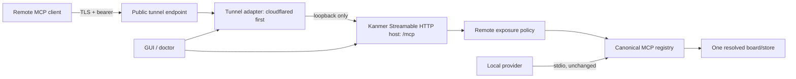

# ADR-0017 — Streamable HTTP remote access

- **Status:** accepted
- **Date:** 2026-08-20
- **Owners:** EPIC-010

## Context

Kanmer’s existing MCP server is a local stdio process with one canonical registry and a file-backed, single-project board store. Remote MCP access needs a standards-based transport without forking that registry, weakening document/expected-project gates, turning a tunnel provider into the transport, or exposing the board listener on the LAN. It also needs a practical first-release security boundary that GUI and headless users can diagnose.

The repository pins `@modelcontextprotocol/sdk` at `^1.30.0`. The MCP protocol specifies Streamable HTTP as the remote HTTP transport and warns local implementations to validate `Origin`, bind localhost, and authenticate connections. The current implementation must re-check the exact SDK API/spec pairing before it implements this decision.

## Decision

Kanmer will add one explicit remote mode around the existing MCP registry:



1. **Transport:** Streamable HTTP is the sole remote MCP transport. `/mcp` supports SDK/spec-defined `POST`, `GET`, and `DELETE`. Stdio remains the local default.
2. **Registry:** HTTP and stdio compose the same tool/resource/prompt registry. Remote exposure is one central policy that excludes background dispatch; no remote copy of tool definitions exists.
3. **Session:** first release uses bounded, in-memory, stateful SDK sessions generated by the server and invalidated on expiry, rotation, deletion, or process restart.
4. **Authentication:** application bearer authentication is mandatory before parsing or session work for every endpoint method. Tokens are protected references, not command-line/query/config/log values, and rotation invalidates sessions.
5. **Network boundary:** the host binds loopback only and validates present origins against an explicit allowlist. A tunnel provides public TLS/reachability but is not the application-authentication authority.
6. **Tunnel architecture:** adapters own provider process lifecycle and expose generic validate/start/status/stop/log operations. `cloudflared` is the first implementation. Providers are adapters, never alternate transports.
7. **Project boundary:** one host process is permanently bound to one resolved board/project fingerprint. Project changes restart the host rather than route one URL among boards.

The following normal lifecycle is required:

```mermaid
sequenceDiagram
  participant O as Operator / GUI
  participant H as HTTP host
  participant A as Tunnel adapter
  participant C as Remote client
  O->>H: resolve one board, load secret reference, bind loopback
  H-->>O: redacted ready + local health
  O->>A: start(validated loopback origin)
  A-->>O: connected/degraded status
  C->>H: tunnel request with bearer and allowed Origin
  H->>H: authenticate, initialize or resume bounded session
  H-->>C: SDK Streamable HTTP response
  O->>H: stop accepting; close sessions/listener
  O->>A: stop child; collect redacted status
```

## Alternatives considered

| Alternative | Decision |
|---|---|
| Remain stdio-only | Rejected: it cannot serve an explicitly remote client behind a tunnel. |
| Legacy HTTP+SSE transport | Rejected: Streamable HTTP is the MCP-selected remote transport and centralizes current protocol behavior in the SDK. |
| WebSocket | Rejected: additional protocol/lifecycle surface with no approved product need. |
| Custom REST/JSON-RPC/SSE implementation | Rejected: duplicates framing, negotiation, and session behavior the official SDK owns. |
| OAuth/OIDC first | Deferred: a larger identity/scopes/dynamic-registration design than the first possession-token release. |
| Direct LAN or wildcard bind | Rejected: increases DNS-rebinding and network exposure; the default must remain loopback behind a controlled tunnel. |
| Vendor-specific tunnel built into request handlers | Rejected: couples protocol, provider lifecycle, and process control; adapters keep the transport provider-neutral. |
| Multi-board router at one endpoint | Rejected: confused-project risk and a larger authorization/routing model; one process owns one board. |
| Hosted Kanmer relay | Rejected: creates a hosted service, data path, and operational scope not approved for this release. |

## Consequences

### Positive

- Remote clients use a current MCP transport while local provider behavior remains stdio-compatible.
- The loopback origin, mandatory bearer check, origin validation, one-project process, and dispatch exclusion constrain the first-release blast radius.
- The canonical registry keeps tool schemas/gates/errors aligned across transports.
- Adapter separation permits cloudflared first and later providers without changing protocol handlers.
- GUI and doctor can report distinct listener, auth, session, tunnel, and handshake health.

### Negative and risks

- A bearer token is a possession credential; it does not provide per-user attribution or scopes.
- Tunnel provider and local host remain trusted operational boundaries.
- In-memory sessions disappear on restart and cannot support distributed/multi-instance serving.
- Each remotely served project requires its own process/listener/tunnel, and child-process lifecycle/redaction is operational work.
- SDK transport APIs evolve; implementation must pin and test the actual supported SDK/spec pair rather than copy an unpinned current example.

## Security implications

Authentication precedes parsing/session creation; present Origins are validated; wildcard CORS and wildcard bind are prohibited; tokens and full session ids are redacted; tunnel processes use executable/argument/environment controls; and the remote tool policy omits dispatch. Provider access control is supplementary. The concrete normative acceptance matrix is FRD-025.

## Compatibility, migration, and rollback

Remote mode is off unless configured. Enabling it adds a loopback listener/tunnel around one project and does not migrate board data or alter existing stdio registrations. Stopping the listener/tunnel invalidates remote sessions but leaves board files untouched and restores a stdio-only operational posture. A defect can therefore be rolled back by disabling remote mode and removing its project-scoped configuration/secret reference under the applicable secret-store policy.

## Follow-up and supersession

[[MCP-021]] implements the adapter contract/cloudflared first; [[MCP-025]] the HTTP transport; [[MCP-026]] bearer authentication; [[MCP-027]] doctor; [[GUI-095]] GUI operation; [[DOC-013]] the provider-neutral manual; and [[MCP-028]] integrated proof. OAuth, multi-board routing, persistent sessions, browser access, and another remote transport require a new approved ADR; they must not be smuggled in as extensions to this one.

## Sources

- Model Context Protocol, [Streamable HTTP transport specification (2025-06-18)](https://modelcontextprotocol.io/specification/2025-06-18/basic/transports), consulted 2026-08-20.
- Model Context Protocol TypeScript SDK, [server guide](https://github.com/modelcontextprotocol/typescript-sdk/blob/main/docs/server.md), consulted 2026-08-20.
- Cloudflare, [Create a locally-managed tunnel](https://developers.cloudflare.com/tunnel/advanced/local-management/create-local-tunnel/) and [configuration file](https://developers.cloudflare.com/tunnel/advanced/local-management/configuration-file/), consulted 2026-08-20.

Related: FRD-025 · FRD-022 · FRD-023 · [[EPIC-010]] · [[MCP-021]] · [[MCP-025]] · [[MCP-026]] · [[MCP-027]] · [[MCP-028]] · [[GUI-095]] · [[DOC-013]].
